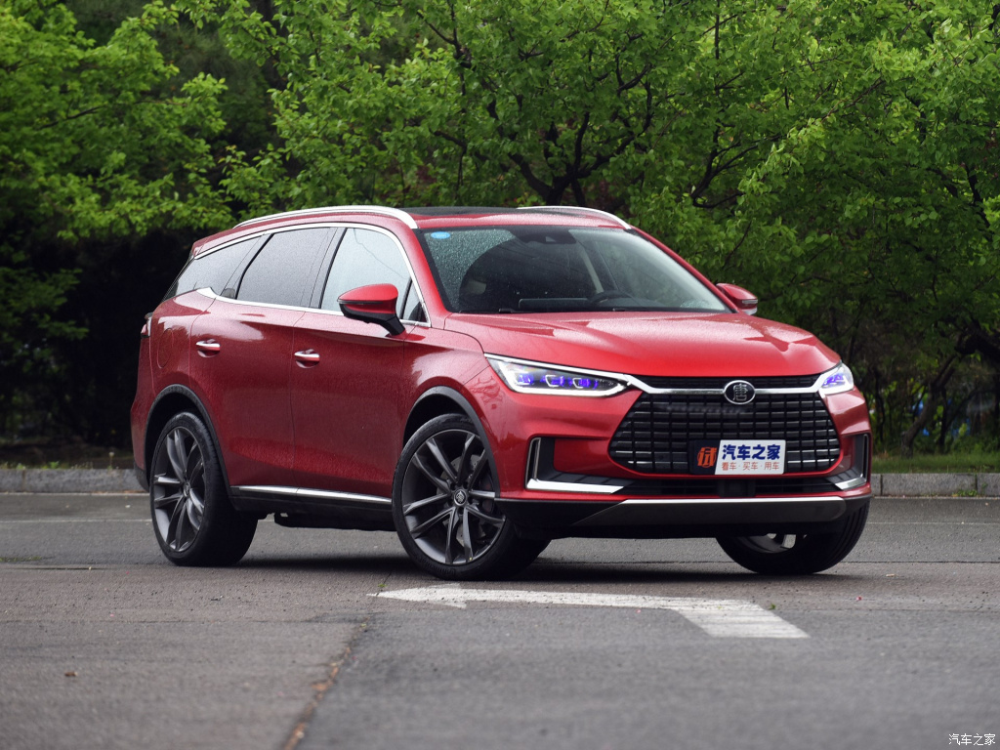
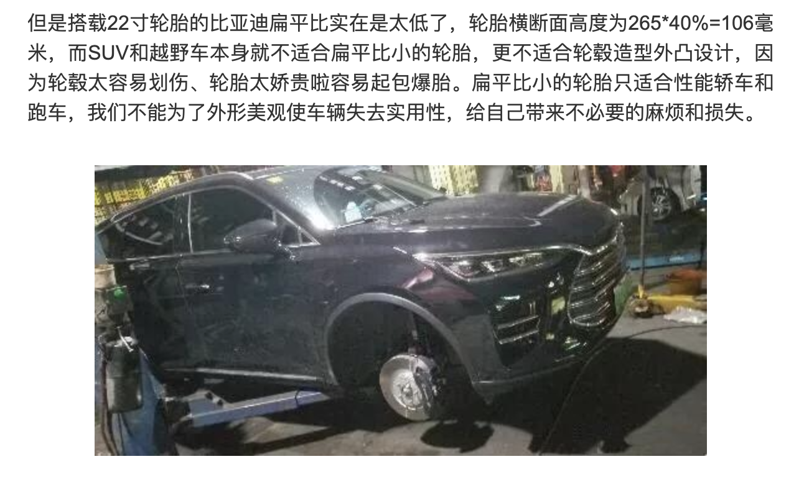
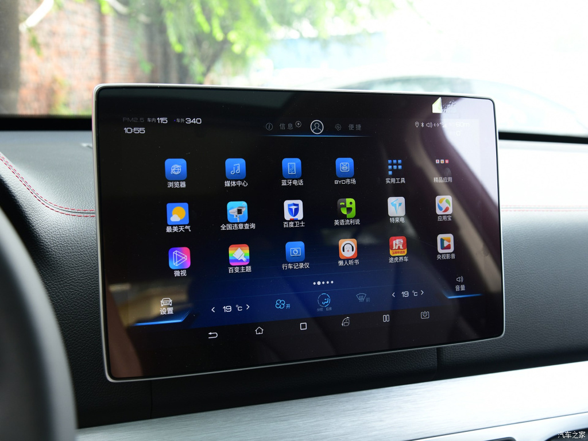
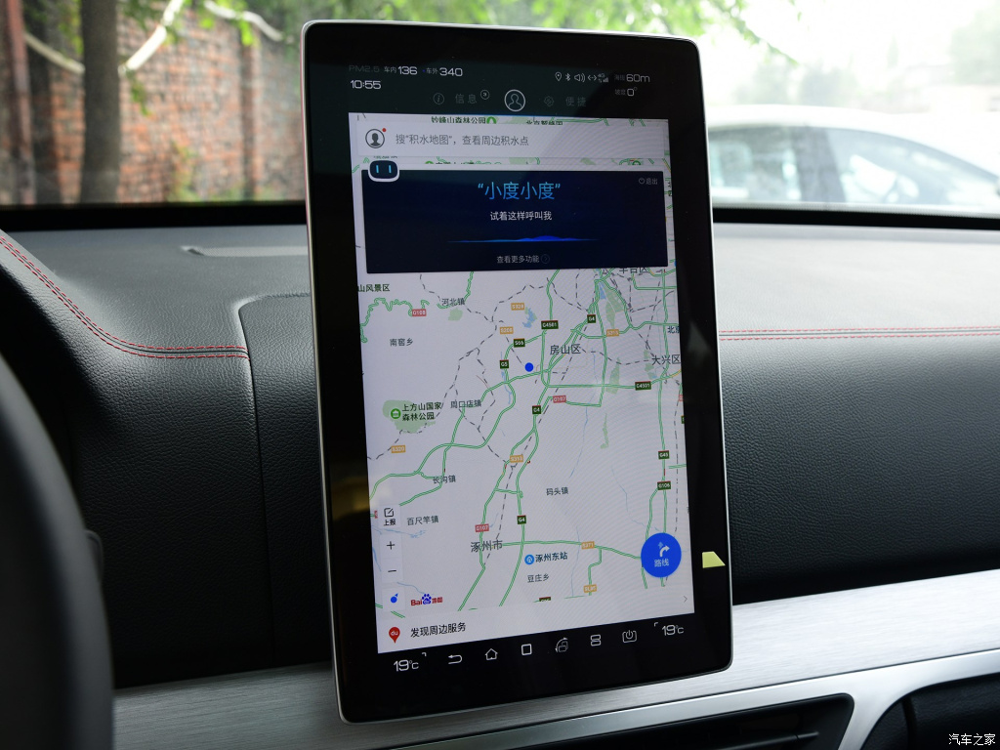

# 比亚迪 唐-新能源

* 厂商指导价：23.99-35.99万元

满分100分制
1. 外观：80分，dragonface家族脸谱很耐看，流水式转向灯，贯穿式尾灯都是主流设计，突出式大轮毂，40扁平比的宽胎，非常亮眼。但是中国的路况非常容易爆胎和损伤轮毂，实用性稍差。

2. 车机系统：70分

    1. 基本是原生安卓系统的大屏版，BYD应用市场中的应用，没有做筛选和为车机的场景做优化。
    
    2. 车机账户和各个应用的账户没有打通，需要分别注册。
    3. IC屏和车机屏没有打通，在IC上不能控制导航，音乐等等
    
    4. 由于原生安卓系统的原因，每个应用程序启动都占据了全部屏幕，比如启动导航之后，音乐虽然还在播放，但是我不知道播放哪首。启动音乐之后，我的导航界面就消失了。
    5. 屏幕没有一定的倾斜度，导致操作的时候需要前倾身体，在驾驶过程中非常不便。
    6. 导航系统完全是百度导航的手机版，没有做任何和车相关的改进。
    
    
    7. 想要电话的时候，无法通过方向盘的按键，去选择给哪个人拨电话。
3. 语音识别：70分
    1. 主流语音识别的基本的功能都支持，语音合成输出略显生硬
    2. 不支持多轮对话，需要频繁唤醒交互
4. 雷达：60分
    1. 敏感度低，基本距离需要十分近才报警；360环影摄像头的分辨率低
5. 座椅：85分
    1. 配置很全，通风，加热，腰部支撑都有，座椅很软。
    
    2. 支撑性略弱
6. 空间：90分
    1. 前后排都很宽敞
7. 驾驶感受：70分
    1. 转向系统比较模糊，底盘调教偏向舒适性，即使切换成运动模式，只是方向边的稍微有点沉，提速稍快，其他的没什么变化
    2. 可能转向系统比较模糊，加上视野问题，感觉驾驶的车比实际的还要宽大。不像GLC，虽然车很大，但是感觉像开一个小车。
    3. 提速性很不错，可以对标25w以上的电动车型
    4. 比较像日系车的驾驶感受，快速变道或者转弯，侧倾明显。
    5. 过减速带的时候，底盘比较散，不紧凑。
8. 氛围灯：50分
    1. 即使调到最亮，但是效果不明显，基本达不到烘托氛围的效果
9. 内饰细节：70分：
    1. 按键塑料感较重，阻尼，手感一般
    2. 空调出风口塑料做工较差
    3. 仪表台软性材料覆盖，还不错
10. 辅助驾驶：60分
    1. 跟车功能：无法全范围车速跟车，刹停之后，起步需要给油门。acc设置距离为1格的时候，距离非常近才刹停，比较危险。
    2. 车道偏离报警：虚线正常变道也会报警。
    3. Autohold功能：等红绿灯很实用，但是市区跟车不太实用，经常被加塞，
11. 充电：昨天体验了在地库的星星充电，主要问题：
    1. 充电桩在地库，手机4G信号不好，导致下载APP，充值，确认充电，都要跑到停车场地面。解决方案—>设置现场wifi
    2. 很多车充完电，车主不在，还在占着车位，导致空闲的桩很少。 解决方案—>多于一小时的停车费加倍收取，或者改造可以升降的停车位
    3. 充电成本不低：DC 1.7元/度 + 停车费 + 等候的时间成本，不比混动车的油耗成本低。
    4. 充电桩的维护不到位：20个桩，大概有6-7个是坏的 
    5. 充电桩的配套环境比较差：夏天没有空调比较热，洗手间在很远的地方
    6. 充电桩的位置没有指示牌：在比较大的停车场寻找需要一段时间。

