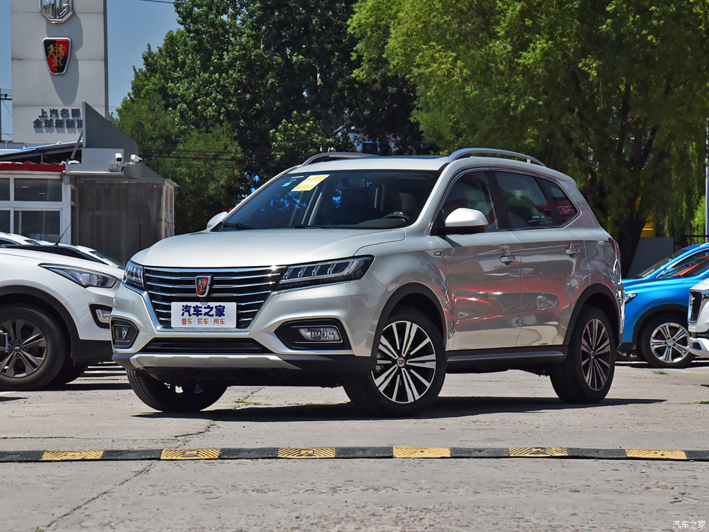
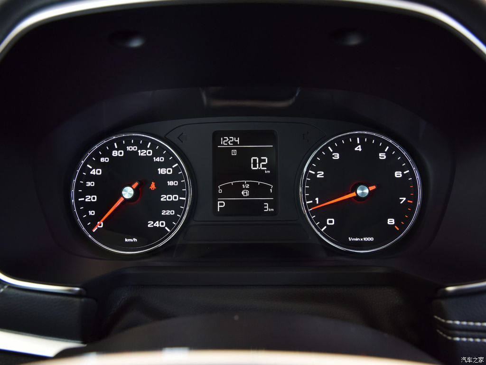
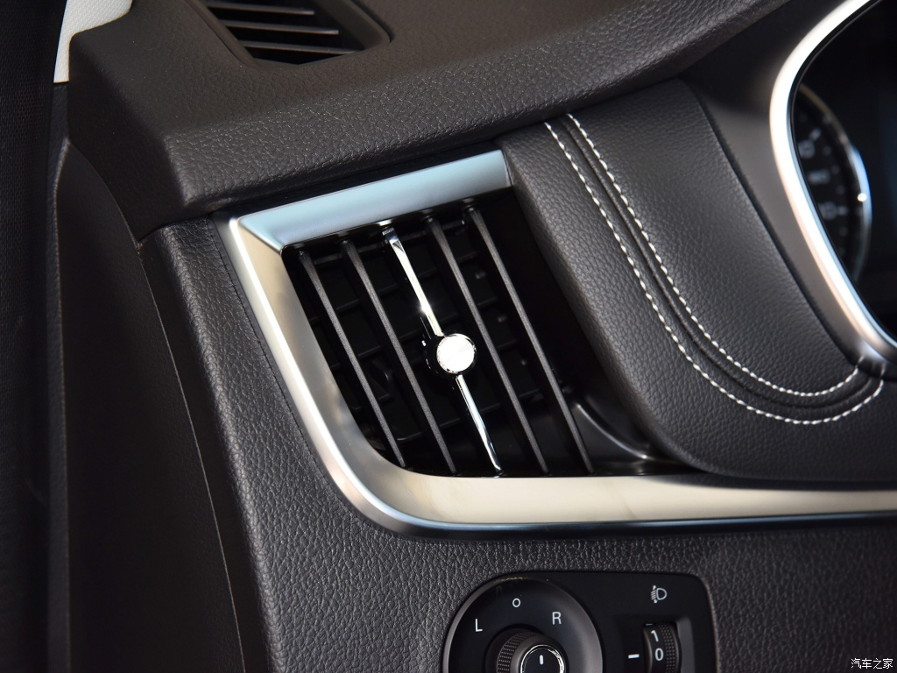

# 荣威 RX5

* 厂商指导价：9.98-18.58万元

荣威RX5的亮点：车机系统采用斑马V3.0

满分100分制
1. 外观：60分 荣威的统一车型外观，刚出的时候比较亮眼，现在看来比较街车的样子，没有什么亮点。
2. 车机系统：90分
    1. 斑马深度定制的车机系统，所有应用都做了和车机的优化，包括按键，界面布局，操作流程，容易上手，没有违和感
    
    
    2. 可以实时监测车辆的保养易损件（机油，三滤），直接可以预约更换，整个流程非常清晰简洁
    
    
    3. 主要功能都需要联网，流量消耗可以实时观察，购买，另外可以连接手机热点，使用手机流量，很符合国人习惯。
    
    
    4. 车机账户和各个应用的账户没有打通，需要分别注册。
    5. 可以添加智能设备，行车记录仪，无人机，空气净化器，运动相机，麦克风，儿童安全座椅
    
    6. 流量价格不贵，8.8/week，18/month 
    
    7. 商城出售的东西都和车相关，比较合理，但是没有做个性化推荐。
    
    
    
    
    8. 导航提供目的地预测，停车违章提醒（咋提醒？），显示常去地点。
    
    
    9. 导航提供个性化图层：吃货地图，车友组队，旅途景点推荐
    
    10. 行程和路书功能在陌生城市驾驶的时候很实用
    
    
    11. 导航虽然提供的设置选择项目不多，但是都是最常用和最实用的功能，不繁琐，小而美。
    
    
    12. 卡拉OKapp放在主要的位置，作为一个不常用的功能。感觉比较违和。
    13. 地图数据可以和手机一样，分城市更新，不消耗而外的流量。
    
    
3. 语音识别：70分
    1. 主流语音识别的基本的功能都支持，语音合成输出略显生硬
    2. 某些功能对话支持多轮，比如关闭导航，放大缩小地图。
4. 雷达：60分
    1. 敏感度比较低，尤其是侧向雷达，基本距离需要十分近才报警；摄像头的分辨率低
5. 座椅：50分
    1. 后排上翘，坐姿不舒适。
    2. 驾驶位电动调节，其他手动调节。
6. 空间：70分
    1. 前后排都很宽敞，符合主流的空间布局
7. 驾驶感受：50分
    1. 发动机动力比较弱，噪音大。
    2. 转向系统比较模糊，底盘调教和质感很廉价，符合10w SUV的定价。
    3. 方向手感比较轻，没有路感。
    4. 油门比较沉而且涩
8. 内饰细节：60分：
    1. 按键塑料感较重，阻尼，手感一般
    2. 空调出风口按钮金属感，但是手感较差
    
9. 空调：50分 制冷效果不佳。
