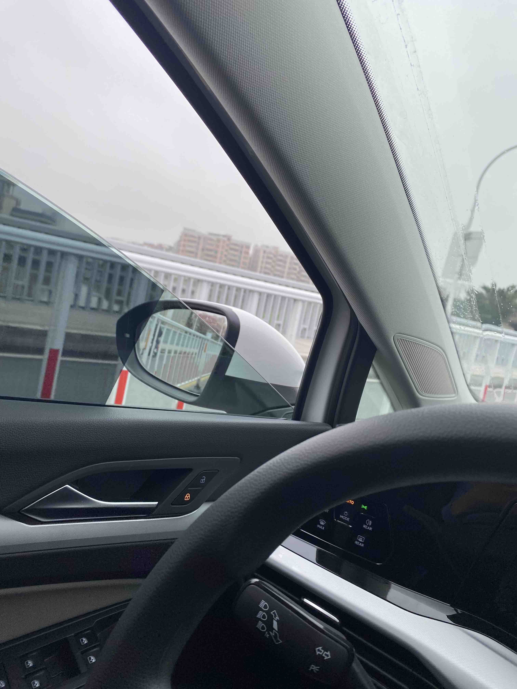
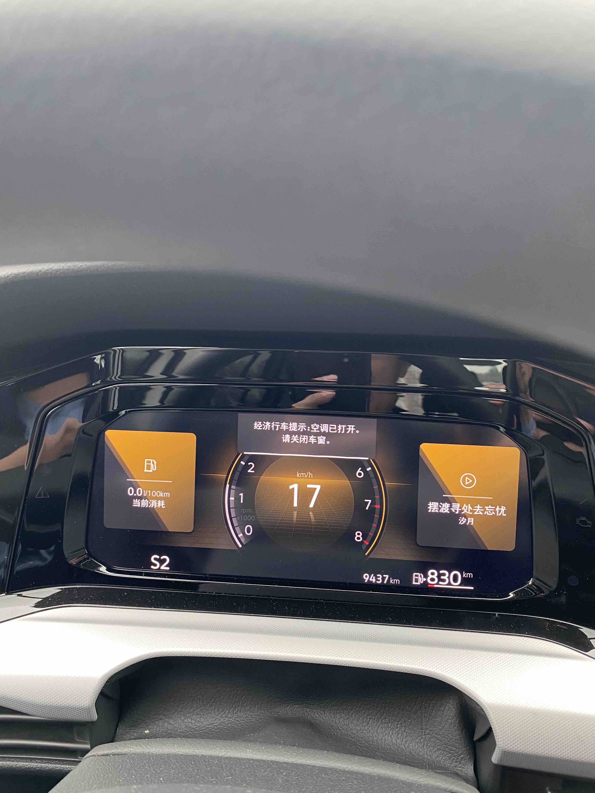

# 场景引擎

## Overview
场景引擎在车机系统向跨域融合的过程中起着至关重要的作用，各家车企也或多或少在自家的车机中加入了场景相关的功能，有的复杂有的简单。
本文主要简要总结一下各家车企在车机中场景引擎的实现。

## PART1: 高合汽车- HiphiX

高合汽车是我试驾的所有车中，最脑洞大开的一个存在。先暂且不谈车本身的质量价格等等，这辆车存在的意义在于把车辆网领域敢想的东西
通通落地，抛却一切安全，法律等等，如果你是一个车联网发烧友，是个非常好的试验田。宣传上说有个hiphi lab,可以在开放的平台上，
开发新场景，目前还没找到。

### 场景概述

*场景分为三种：*

* 精选场景：是厂家在出厂前预制好的，但是自己可以做简单的修改，后面详细讲
* 高级场景：停车时候使用的，主要侧重于仪式感，比如女王驾到，类似于蔚来的女王座椅
* 红白空间：由社区提供的，或者热心车主共享的，如何开发和共享暂时还没有仔细研究。

*执行方式：*
* 智能推送：类似于在zerolayer上显示一个图标，用户点击确认即可执行
* 自动执行：根据规则自动执行，比如温度低于10度打开座椅加热
* 用户主动出发：用户浏览所需要场景，点击场景，即可触发

### 场景详解

* 红白空间界面
  
  

* 精选场景界面

  

* 具体场景1：去公司，自动触发，应该是根据机器学习得到用户的行为习惯
  

* 具体场景2：回家，自动触发，类似于去公司，应该是根据机器学习得到用户的行为习惯
  

* 具体场景3：一键降温，自动触发/智能推送
  

* 具体场景4：一键升温，自动触发/智能推送
  

* 具体场景5：方向盘和座椅加热，人为主动触发
  

* 具体场景6：方向盘和座椅加热结束，这个是配合上一个一起用的，人为主动触发加热后，这个就会弹出来，作为结束加热的快捷方式。
  

* 具体场景7：宠物模式，人为触发
  

* 具体场景8：抽烟模式，人为触发
  

* 具体场景9：结束抽烟模式，配合"抽烟模式"使用，"抽烟模式"触发后，这个自动弹出
  

* 具体场景10：雨天模式，自动触发/智能推送
  

* 具体场景11：舒适睡眠SPA，智能推送
  

* 具体场景12：女王驾到，人为触发
  

* 具体场景13：一键看球，人为触发（车友贡献）
  

* 具体场景14：发射副驾驶，人为触发
  

### 场景编辑和修改
* 中断条件：无法修改
* 触发条件：也叫判断卡片：比如副驾是否有人

## PART2: 东风汽车 - 岚图FREE

作为一个传统的保守的军工背景的主机厂，岚图FREE的表现着实让我感到惊艳，但是仔细品味，车机覆盖的点很多，但是最后场景判断
的准确度，用户的体验是否好，需要长期磨合。在我试驾的过程中，它总是提醒我"你好像心情不太好"，但是我并没有。。。还是，
在岚图看来，我是忧郁男孩？

### 场景概述

岚图对于场景的实现分为两种方式：
* 用户创建：只能保存当前状态和做有限的定制，详见后面
* 通过"提醒"这个入口，提供多方面的智能场景服务

### 场景详解

* 用户创建场景：添加场景模式
   * 用户只能保持当前以下系统的状态：空调，音量，氛围灯，香氛，天幕
   * 可以开启音乐，但是不能指定歌曲；可以打开相机拍摄
     
     
     
* 通过"提醒"这个功能入口点： 分为 *安全提醒*， *特色服务*，*温情关怀*三种
  
  
   * 安全提醒: DMS和离车后宝宝监控（咋监控？咋知道宝宝在车里？准确度怎么样？）
     

   * 特色服务: 行程出发，长途旅行，上车前，堵车，停车，周末吃玩，上下班，离车前，行车中，油量电量不足
     (这其中包括航班，火车，网约车出发提醒，没想明白怎么打通这么多三方，和车机集成，账号怎么统一？所以感觉应该很多还没有实现吧？)
    
    
     
   * 温情关怀: 车内人员情绪，行车过程关怀，下班问候，商务着装，陪伴时光，宝宝儿童乘车，出门防护，停车场出入。
  这个感觉更扯了，其中有一项"送宝宝去医院的情绪安抚"，怎么知道送宝宝去医院？？？
   
     

   *总之，岚图FREE这个想法很好，但是饼画的太大了。想知道，QA咋测的？

## PART3: 斑马智行- Venus 2.0

斑马智行主要通过三种方式实现场景引擎:

* [固定场景](Venus20.md#场景服务)

* [用户自定义语音指令和动作](Venus20.md#可编辑的语音指令)

* 后台推送规则

## PART4: 宝马 - 3系

在体验了近一年宝马新三系的车机系统,经历了3次OTA，可以很自信的说，宝马基本没有基于场景引擎的feature。如果勉强说有，
那么用户能感知的仅仅是通过一些 简单的条件规则触发特定的提醒或者一些简单的动作，而且这些feature都是分散在各个功能模块，
比如，智能空调。目前我体验到的：

1. 节假日祝福

2. 空气质量不佳，自动切换内循环

3. 在导航系统中有"预测服务"，但是我从来没有体验到预测任何目的地。

4. 宝马上线了一个"小场景"的生态服务，实际上是集成了微信的小程序。最终的体验是：和车根本就是隔离的，车身的数据和这些小程序
没有打通，用户需要在特定的场景下自己找到应用，打开应用。

## PART5: 蔚来 - ES6

这台车是在展厅体验的，没有长时间驾驶，所以场景检测的准确度不确定，并且ES8和ES6的车机系统是完全一致的。

### 场景概述

蔚来汽车的场景是以"智能功能"分布在各个子系统中，比如"驾驶"，"舒适"，"空调"，有的需要用户自主开启，有的会自动触发。

### 场景详情

* 驾驶

在驾驶的菜单中，有两个模式"换胎模式"和"拖车、洗车模式"，奔驰好像也有一个"CARWASH MODE"但是不知道如何激活。

   * 换胎模式
     

   * 洗车拖车模式
     
     
     
* 空调

   在空调控制中，唯一和场景有关的是"自动除雾"
   

   * 自动除雾
     

* 蔚来的车机系统很简洁，上手难度低，没有很深的菜单结构，体验挺好。

## PART6: 蔚来 - ET7

这台车对于场景功能做了比较深度的测试，相对于ES6有了一定的增强。

### 场景概述

蔚来汽车的场景是以"智能功能"分布在各个子系统中，比如"驾驶"，"舒适"，"空调"，有的需要用户自主开启，有的会自动触发。

### 场景详情

* 驾驶

在驾驶的菜单中，有两个模式"换胎模式"和"拖车、洗车模式"，奔驰好像也有一个"CARWASH MODE"但是不知道如何激活。

ET7增加：超级节能模式，驾驶员疲劳提醒，驾驶员分心提醒。

* 空调

  在空调控制中，唯一和场景有关的是"自动除雾"
  

    * 自动除雾
      
    * ET7增加：
      * 自动除雾：根据车内气候状况主动除雾。
      * 智能方向盘加热
      * 智能座椅加热

* 安全（ET7新增加）
  * 智能车内感知：提供儿童检测，车内成员位置检测能力，实现的功能：智能音场调节，空调对人吹，面容密码，智能密码储物箱

* 提供了"快捷场景"的app（ET7新增加）：
  * 提供了"广场"和"我的"场景模块，广场是内置的场景，"我的"是用户自己创建的场景
  * 创建场景：分为"手动"和"自动"，手动需要用户自己触发，自动需要输入条件，根据条件触发。
  * 自己创建的场景可以设置是否通过nomi启动。
  * 条件一：
    * 时间---时间点（小时分钟）、日出日落（前后具体时分）、车机完全启动时
    * 位置---到达、离开（某个具体地点，可以通过搜索，定义半径多大的）
    * 天气---PM2.5（具体数据），空气等级（轻度，重度），洗车指数（适宜，较不适宜）
    * 环境---车内温度（高于低于具体温度），车外温度（高于低于具体温度），车内PM2.5（高于低于具体问题）
    * 驾驶---续航里程（大于小于具体里程），电池电量（大于小于百分比），车辆档位（P/D），车速（高于低于KM/h）
    * 车门---四个门（开启、关闭）
    * 座椅---安全带（系上，解锁）
  * 条件二：状态，返回true或者false
    * 导航
      * 预计到达时间（大于或者小于某个具体的时间点）
      * 导航预计到达距离（大于或者小于某个具体的距离）
      * 导航目的地是否是家，是否是公司
      * 导航状态：导航态，巡航态
    * 媒体状态：播放，暂停
    * 天气：同上
    * 环境：同上
    * 驾驶：同上
    * 充电：
      * 充电状态：充电中，未充电
      * 预计充电时间：大于小于具体的时间点
    * 车门：同上
    * 车窗：四个车窗（全开，全关）
    * 座椅：五个座椅的乘坐状态（已经就坐，未就坐）
  * 生效时间：
    * 重复：每天，运行一次，自定义（周一到周日），
    * 时间：（开始具体时间，结束具体时间）
    * 运行前需要询问
  * 执行的操作
    * 推荐
    * 空调
      * 开关---开关
      * AC---开关
      * 强制制冷---开关
      * 强制制热---开关
      * 循环模式---自动、内、外
      * 前、后除雾---开关
      * 前排自动---开关
      * 前排风量---8档
      * 前排空调温度---具体温度
      * 主驾、副驾空调温度---具体温度
      * 主驾、副驾吹风模式---自由，对称，扫风，关闭
      * 前排除霜---开关
      * 前排吹面---开关
      * 前排吹脚---开关
      * 后排、后左、后有空调开关---开关
      * 后排风量---8档
      * 后排自动---开关
      * 后排左、右吹风模式---自由，扫风，关闭
      * 后排吹面---开关
      * 后排吹脚---开关
      * 负离子---静音，关闭，自动
      * 香氛---开关
      * 外后视镜加热---开关
    * 门窗---速度8KM/H以下可用
      * 四个窗户---开启0-100连续值
      * 所有窗户---透气，通风，记忆，关闭
      * 四个车窗的儿童锁---开关
    * 灯光
      * 大灯---自动，示宽灯，近光灯
      * 室内灯光照明---寻物，夜灯，隐身
      * 所有阅读灯---开关
      * 主驾，副驾，左后，右后阅读灯---开关
    * 氛围灯
      * 氛围灯开关---开关
      * 氛围灯主题---自然日光，阳光，星辰，旷野，秘境，萤火，满月，霞光，喜马拉雅，自定义
      * 氛围灯模式---呼吸，常亮
    * 座椅舒适
      * 方向盘加热---开关
      * 主驾，副驾，左右后座椅加热---3档，关闭
      * 主驾，副驾，左右后座椅通风---3档，关闭
      * 主驾，副驾，左右后座椅按摩模式---猫步，波浪，动态，腰部，上背部
      * 主驾，副驾，左右后座椅按摩强度---2档，关闭
    * 位置调节---驻车状态下可用
      * 主驾，副驾位置加载---驾驶位置，备用位置，休息位置，离车位置，其他位置
    * 系统设置
      * 前排屏幕保护---开关
      * 后排屏幕保护---开关
      * 中控亮度---0-100
      * 中控主题---深色，浅色，自动
      * 仪表亮度---0-100
      * 仪表主题---深色，自动
      * HUD开关---开关
      * HUD亮度---0-100
      * 蓝牙---开关
      * 无线热点---开关
      * 无线充电---开关
      * WLAN---开关
      * 音场模式---前排，主驾，环绕，后排，剧院
      * 锁车提示音---开关
      * 车外提示音---开关
      * 换挡提示音---开关
      * 系统提示音---开关
      * 媒体音量---0-100
      * Nomi、导航音量---0-100
    * 应用操作
      * 打开应用---导航，相册，媒体，电话，设置，泊车影像，视频，用户手册，天气，潮汐，全民K歌，NOMI自拍
      * 延时---设置具体多长时间
      * NOMI回复---输入文字
      * 文字短提示---输入文字
      * 发起导航---去公司，回家
      * 导航到指定位置---search具体的地址，或者选择当前位置，家，公司，收藏夹
      * 导航静音---开关
      * 路况显示---开关
      * 路线偏好---智能推荐，时间优先，费用最少，躲避拥堵，不走高速，高速优先，领航优先
      * 导航语音播报---简洁，详细
      * 车牌限行---开关
      * NIO Radio---播放"最近播放"，播放"我喜欢"，播放"推荐"
      * 喜马拉雅---播放"我的"，播放"猜你喜欢"
      * QQ音乐播放歌单---播放"推荐"，播放"自建歌单"，播放"收藏歌单"
      * QQ音乐播放歌曲---播放搜索的歌曲名字
      * 控制播放器---播放，暂停，上一首，下一首
      * 切换音源---NIO Radio，喜马拉雅，QQ音乐，FM，蓝牙音乐，USB音乐
  

    

* 蔚来的车机系统很简洁，上手难度低，没有很深的菜单结构，体验挺好。

## PART6: Volkswagen - Golf 8

大众的智能化程度相对比较弱，对大众高尔夫8进行一周的试驾，目前我体验到的：

1. 经济行车提示：

当空调在打开的状态，然后打开窗户，等待10秒，IC弹出 warning：经济行车提示，空调已打开，请关闭车窗。

此时如果关闭车窗，提示消失。 然后， 再打开车窗，需要等待更长的时间，大概20秒，又一次弹出提示。

再关闭车窗，提示消失，然后，再打开车窗，提示不出现。

