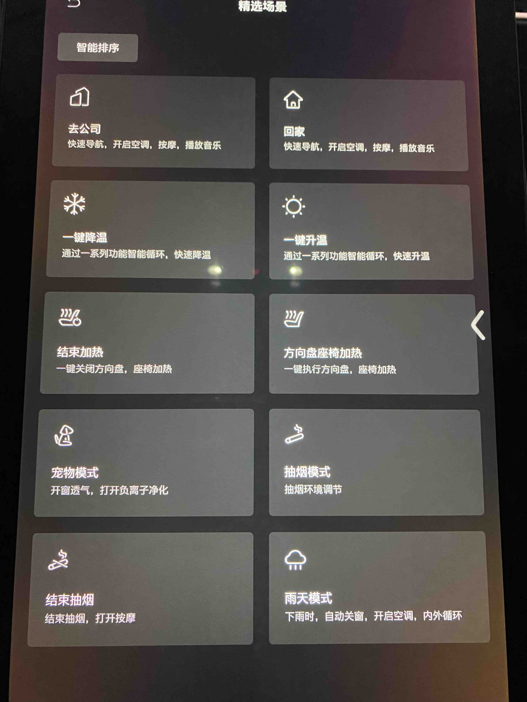

# 场景引擎

## Overview
场景引擎在车机系统向跨域融合的过程中起着至关重要的作用，各家车企也或多或少在自家的车机中加入了场景相关的功能，有的复杂有的简单。
本文主要简要总结一下各家车企在车机中场景引擎的实现。

## 高合汽车- HiphiX

高合汽车是我试驾的所有车中，最脑洞大开的一个存在。先暂且不谈车本身的质量价格等等，这辆车存在的意义在于把车辆网领域敢想的东西
通通落地，抛却一切安全，法律等等，如果你是一个车联网发烧友，是个非常好的试验田。宣传上说有个hiphi lab,可以在开放的平台上，
开发新场景，目前还没找到。

### 场景概述

*场景分为三种：*

* 精选场景：是厂家在出厂前预制好的，但是自己可以做简单的修改，后面详细讲
* 高级场景：停车时候使用的，主要侧重于仪式感，比如女王驾到，类似于蔚来的女王座椅
* 红白空间：由社区提供的，或者热心车主共享的，如何开发和共享暂时还没有仔细研究。

*执行方式：*
* 智能推送：类似于在zerolayer上显示一个图标，用户点击确认即可执行
* 自动执行：根据规则自动执行，比如温度低于10度打开座椅加热
* 用户主动出发：用户浏览所需要场景，点击场景，即可触发

### 场景详解

* 红白空间界面
  
  

* 精选场景界面

  

* 具体场景1：去公司，自动触发，应该是根据机器学习得到用户的行为习惯
  

* 具体场景2：回家，自动触发，类似于去公司，应该是根据机器学习得到用户的行为习惯
  

* 具体场景3：一键降温，自动触发/智能推送
  

* 具体场景4：一键升温，自动触发/智能推送
  

* 具体场景5：方向盘和座椅加热，人为主动触发
  

* 具体场景6：方向盘和座椅加热结束，这个是配合上一个一起用的，人为主动触发加热后，这个就会弹出来，作为结束加热的快捷方式。
  

* 具体场景7：宠物模式，人为触发
  

* 具体场景8：抽烟模式，人为触发
  

* 具体场景9：结束抽烟模式，配合"抽烟模式"使用，"抽烟模式"触发后，这个自动弹出
  

* 具体场景10：雨天模式，自动触发/智能推送
  

* 具体场景11：舒适睡眠SPA，智能推送
  

* 具体场景12：女王驾到，人为触发
  

* 具体场景13：一键看球，人为触发（车友贡献）
  

* 具体场景14：发射副驾驶，人为触发
  

### 场景编辑和修改
* 中断条件：无法修改
* 触发条件：也叫判断卡片：比如副驾是否有人

