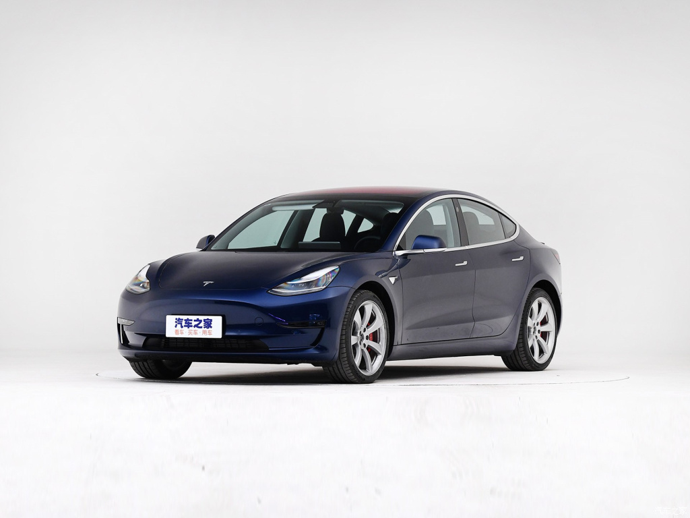

# Tesla Model3

* 厂商指导价：35l59-49.99万元 国产（32.28）

满分100分制
1. 外观：80分，简洁，流线，略显保守，不是特别扎眼，但是比较耐看。

2. 车机系统：90分
    1. 非常流畅，尤其是导航系统，反应相关迅速，地图放大缩小，没有任何卡顿。
    2. 导航系统，功能过于简单，仅仅提供算路选项，没有提供出去导航之外的任何辅助功能，比如预测，通勤。
    3. 和车辆本身的系统连接十分紧密，和车相关的任何功能（辅助驾驶，充电，驾驶模式等等）都集成在车机系统里面。
    4. 车机的功能菜单布局合理，基本可以在很短的时间内，找到想要的功能。
    5. 没有提供物理按键，没有按键反馈，空调调节温度的按钮，在屏幕上太小，需要仔细按，在开车过程中，调节温度，比较危险。
    6. 没有HUD和ID，所有的驾驶信息，包括速度，电量都在大屏上，驾驶员需要转头去看，不方便，也增加了危险性。
    7. 可以玩游戏，但是遇到过退出游戏时候，系统死机，无法退出。
    8. 提供了很多很实用的功能，比如哨兵模式。还有一些很小众的功能，比如宠物车内模式
    9. 提供了易耗品监测的功能：比如玻璃水，但是没有提供购买链接
    10. 屏幕的分辨率很高，字体布局和苹果很像
    
3. 语音识别：60分
    1. 没有深入测试，基本语音的识别率比较低，比如，关闭自动巡航，没有识别出来。
    
4. 雷达：90分
    1. 敏感度还行，最远84cm，能显示前后的距离，摄像头只有后侧有，没有360环影。
    
5. 座椅：85分
    1. 座椅很软，有加热，无腰部支撑和座椅通风，

6. 空间：
    1. 前排还行，后排没有体验，前备箱不算大，能放下一个大号书包，后备箱正常水平，无备胎。
    
7. 驾驶感受：90分
    1. 转向系统非常灵活和精准，运动模式下，方向比较重，很有驾驶乐趣。
    2. 底盘调教在低速时非常软，很舒适，高速下，过减速带稍微有点散
    3. 提速性非常好
    4. 开起来像一台非常灵活的小车，很不错。
    
8. 新奇功能：
    1. 召唤模式，没体验，但是比较新奇。

9. 内饰细节：70分：
    1. 组装工艺较差，接缝很大，并且不均匀
    2. 内饰塑料件，边缘毛刺多
    3. 钢琴烤漆显得比较脏
    
10. 辅助驾驶
    1. 功能很多，设置选项很多，由于试驾路线很堵，没有测试自动驾驶功能。
    
11. 充电：
    1. 充电口可以通过屏幕开启和关闭
    
12. 细节：
    1. 出风口的风向调节很有设计感，出风口也很有设计感。
    2. 木内饰用的恰到好处

13. 刹车：50分
    1. 脚感非常硬，不灵敏，和6代凯美瑞2.4L的脚感很类似。
    