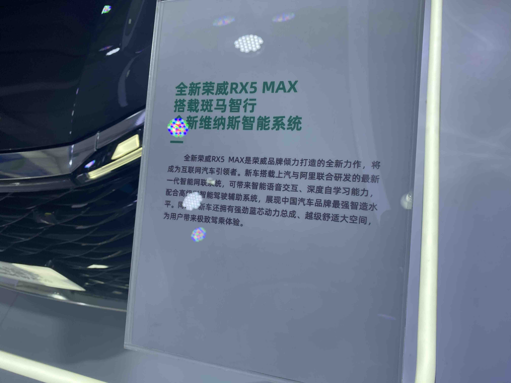
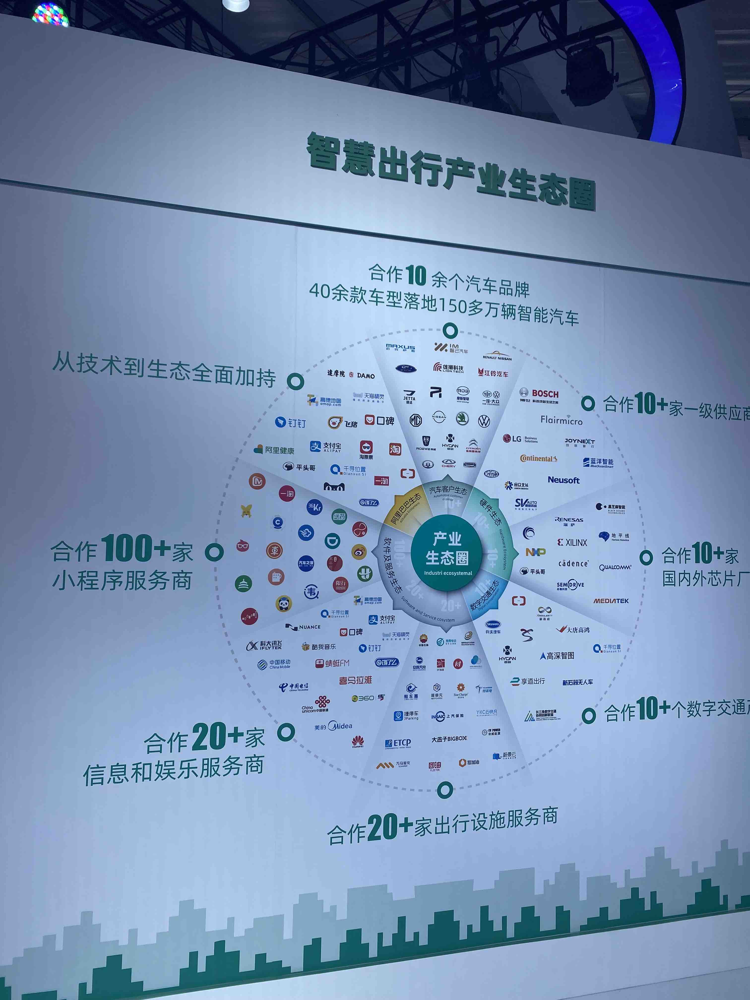
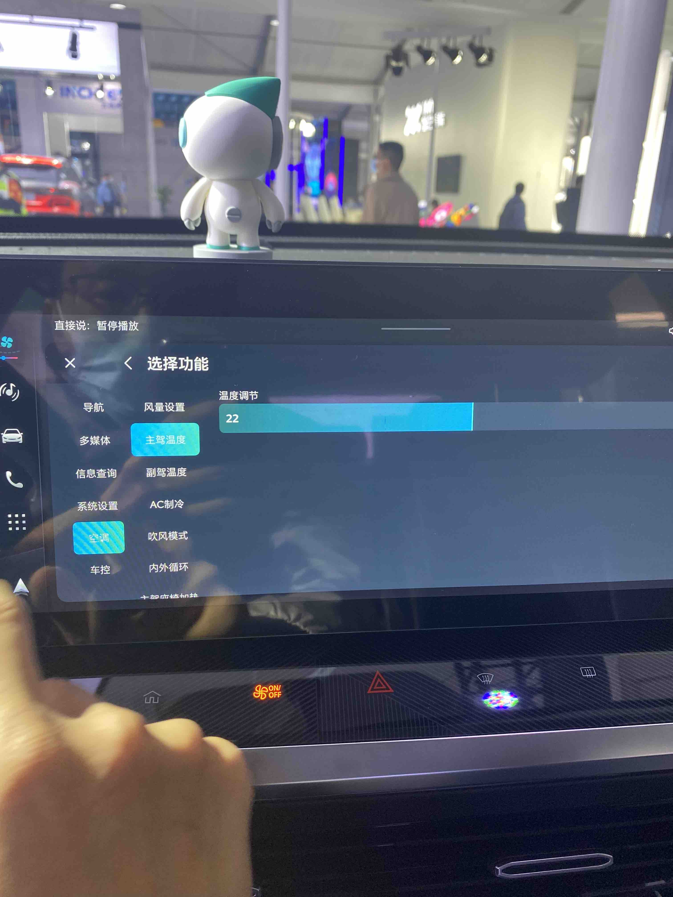

# 斑马智行 - Venus 2.0

## Introduction

* 搭载上汽荣威RX5 Max
* 智能语音是亮点

## 强大的生态支撑

* OEM：上汽系，福特，日产
* 软件及服务生态：小程序来自支付宝小程序
* 阿里生态
* 硬件和Tier1

  
## UI 设计

### 卡片式UI设计为主

* 可以自定义卡片，添加或者删除
* 双桌面
* 小程序首页推荐

## 自定义方向盘控制键

## 三层级的互联服务

* 系统应用: 基础应用
* 生态应用: 深度集成生态圈内容
* 小程序：通过支付宝小程序Web方式上车，分类封装

系统应用: 基础应用

生态应用: 深度集成生态圈内容

小程序：通过支付宝小程序Web方式上车，分类封装

应用市场

## 场景服务

* 通勤
* 车辆状态提醒：加油
* 行程状态提醒：停车场

## 可编辑的语音指令

* 问答式+action
  
添加指令

添加指令界面

导航

多媒体

信息查询

系统设置

空调

车控

# MISC

## 基于AI的接听助理

## 日程

## 车辆设置

## 车控

### 空调界面

## 酷我音乐
### 个人中心

### 播放列表

## 缺点：
* 账号需要多次登录：酷我音乐，爱奇艺，支付宝等等

