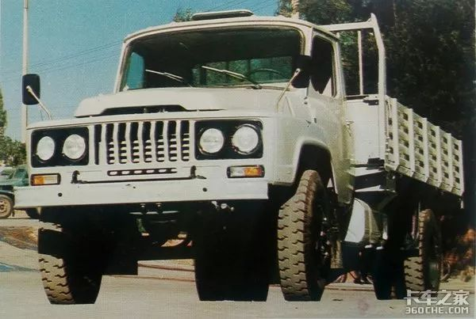
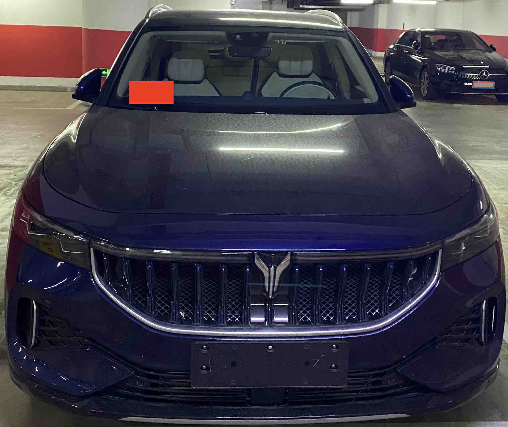
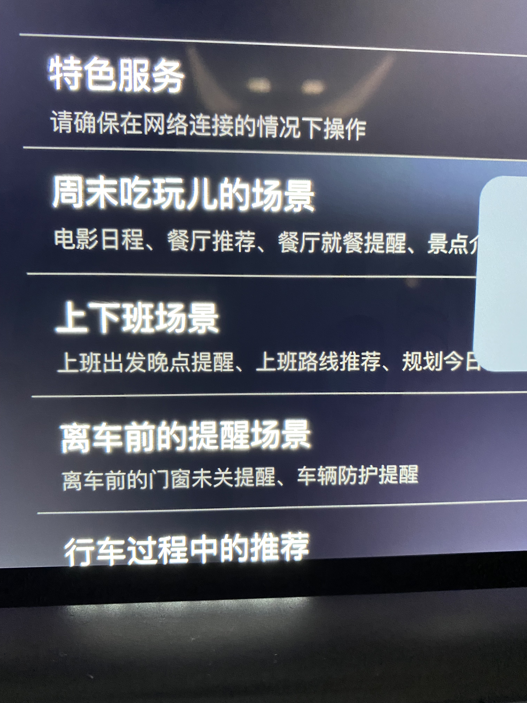
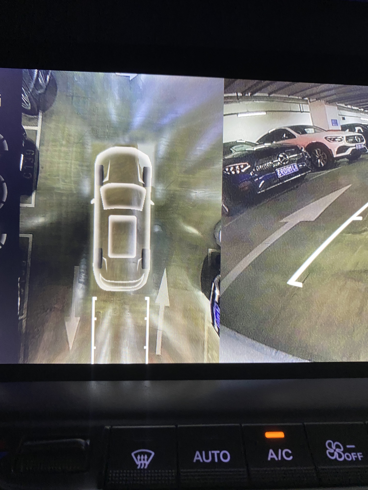
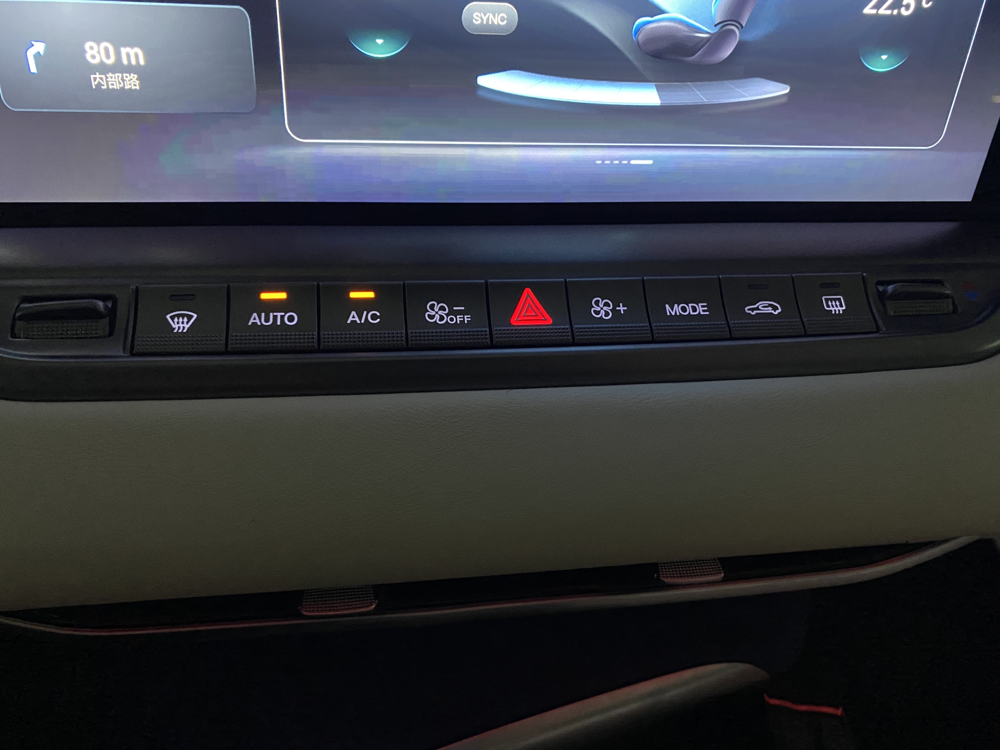
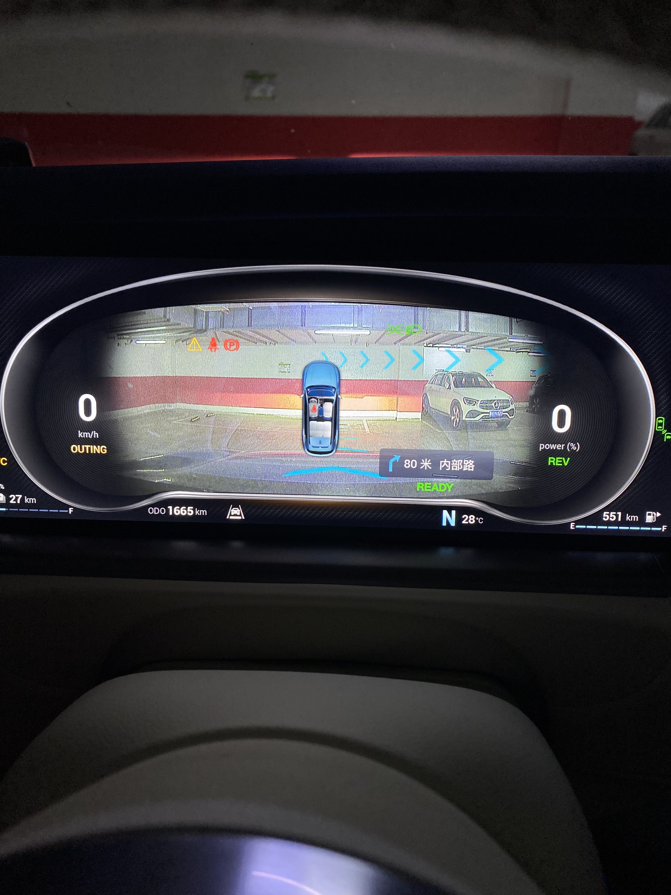
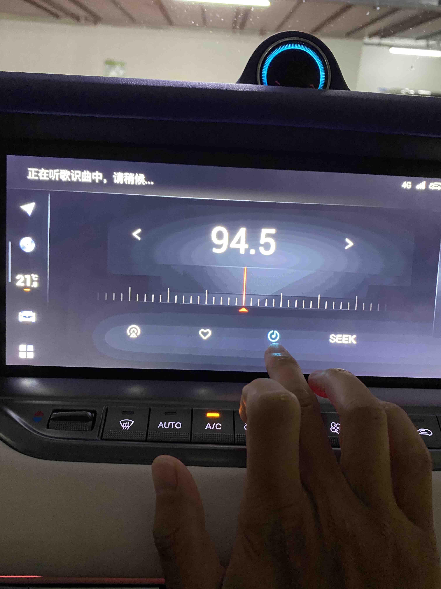
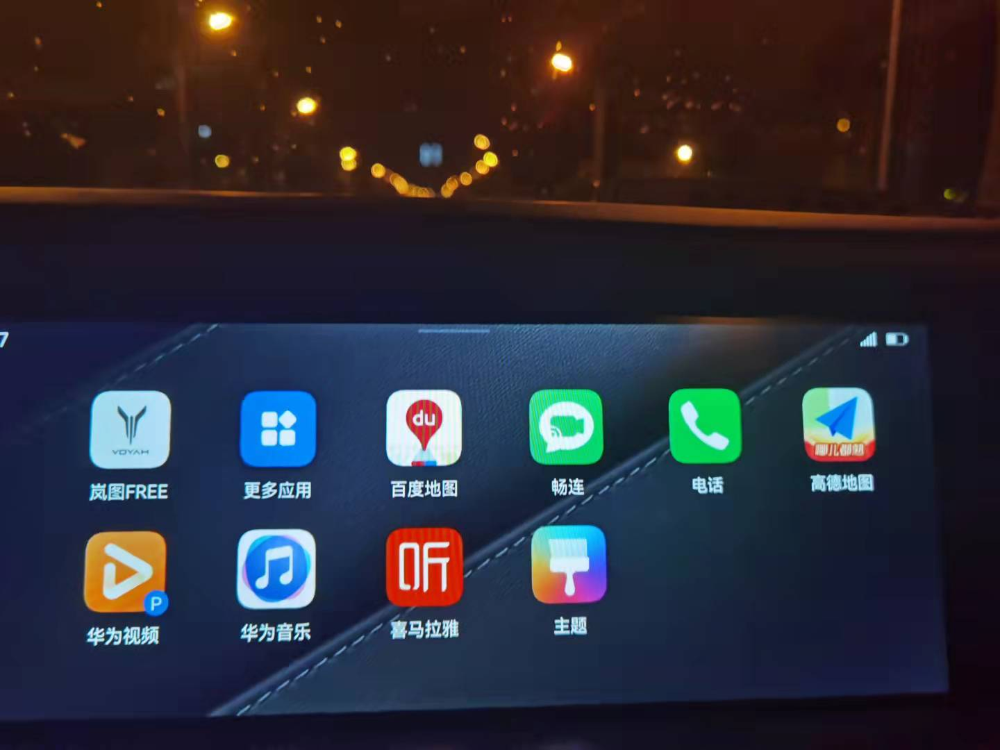
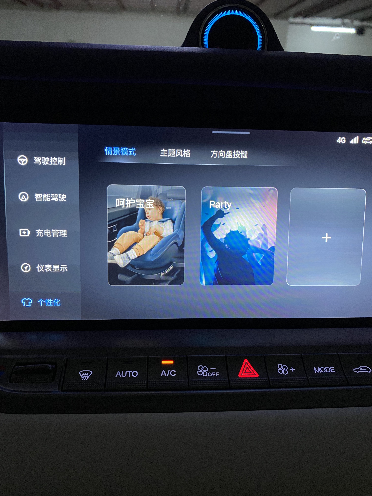
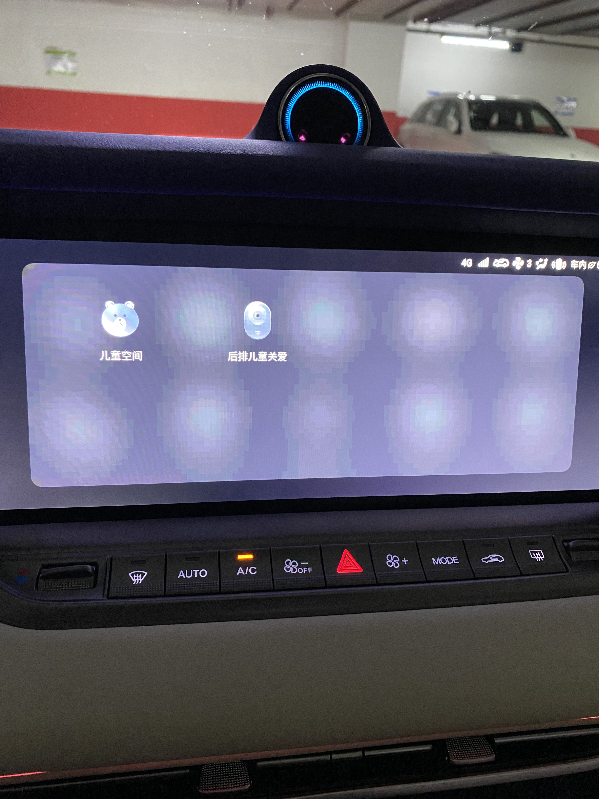

# 东风汽车 岚图 Free

* 厂商指导价： 31.36-36.36万元
分为纯电和增程的两个版本，本次试驾增程式。

满分100分制
1. 外观：80分，外观仁者见仁智者见智，个人认为外观至少不难看出，前脸设计挺刚毅，日间行车灯的灯带具有很好的辨识度，在得知这个车是二汽的，
   不知道是不是先入为主，感觉这个车前脸垂直的进气格栅，有些大东风的影子，唤起了儿时的回忆。后屁股的设计怎么说呢，和林肯飞行家的设计比较相似，
   贯串式的尾灯，处处体现了设计师不想加班但又想紧跟潮流的纠结。
   
   VS
   
  
   
2. 车机系统：80分
   车机功能比较全面，先简单罗列一下优缺点：
   
缺点：
* 系统响应慢
* 使用实景导航，无法显示行车记录仪
* 实景导航箭头和路面，路口的贴合度不好
* 大屏比较大，但只能显示一个功能，比如只能显示导航，音乐，收音机中的一种，当用户想要切换就要不断点击屏幕
* 限行需要在手机端设置
* 加油充电口开启的开关位置在HU中过于隐蔽
* 比较常用的座椅功能，没有设置成hardkey，导致使用座椅加热通风按摩，需要多步操作
* 功能设置的ICON过于小，行驶中设置比较困难
* 车内拍照像素太低，图片模糊
* 车内生态不够丰富，没有用户自主可以选择安装的
* 车内表情识别来识别情感，比较鸡肋。多次模拟困倦，甚至打盹都没有识别到。
* 倒车影像画质一般

优点：
* 提供了初步的场景引擎，根据场景进行提醒，包括：行程出发，长途旅行，上车前，堵车，停车，周末吃玩，上下班，离车前，行车中，油量电量不足，
  车内人员情绪，行车过程关怀，下班问候，商务着装，陪伴时光，宝宝儿童乘车，出门防护，停车场出入。
  
* 倒车影像使用了透明底盘技术
  
* 常用的功能比如空调，车辆相关的功能使用了hardkey，比较方便
  
* 导航使用百度地图，并且在IC中集成了实景导航
  
* 收音机有听歌识别曲目的功能，可以直接加到歌单中
  
* 可以和华为手机通过Hicar进行连接，比较连接速度很快，很便捷
  
* 在线媒体支持酷我音乐，在线视频支持爱奇艺
* 副驾驶可以帮忙添加途经点
* 氛围灯可以随音乐律动
* 可以定义个性化场景，虽然提供的场景很简单
  
* 在到达目的地前，主动语音提醒寻找停车场
* 支持洗车，点餐，停车，预定酒店，预定机票，并且可以车内扫码支付，但是估计功能使用率堪忧。
* 支持车内拍照自拍
* 儿童关爱场景集成了儿童app，后排儿童监控
  

3. 语音识别：70分
   专门把语音识别拿出来说，觉得这个功能很重要。
    1. 主流语音识别的基本的功能都支持
    2. 支持多轮对话
    3. 有时候会意外唤醒，对话等待会干扰车内人的对话
    
4. 特色：
* 天幕式天窗，和波音787的玄窗一样，响应很快，很酷。
* 夜视功能：怎么说呢，早在10年前奔驰S级宝马7系就配置了，但是很鸡肋，后来又都去掉了。现在在这个车上安装，感觉没啥用处。
* HU可以升降，没啥实用性，但有点仪式感。

5. 座椅：85分
    1. 配置很全，通风，加热，腰部支撑都有，座椅很软。
    2. 皮质很细腻
    
6. 空间：90分
    1. 前后排都很宽敞
    
7. 驾驶感受：70分
    1. 整体感受底盘调教，舒适性取向，过减速带或者井盖，都能够很好的过滤，对车内影响很小。但是又有一定的支撑性，不像美系车像开船的感觉。
       但是滤震弹簧有一点点多余的弹跳，和地面的贴服感还差点意思。
    2. 在选择不同的驾驶模式时候，底盘可以升降，但是感觉不是很明显
    3. 提速非常猛，在运动模式下，推背感很明显切持续。
    
8. 氛围灯：50分
    1. 即使调到最亮，但是效果不明显，基本达不到烘托氛围的效果，没有奔驰做得好
    
9. 内饰细节：70分：
    1. 按键做工很细致
    2. 方向盘拨杆比较粗糙，塑料感很重
    3. 门板按键模仿奔驰，比较细致
    4. 车灯按键也和德系相似，安排在左下方
    
10. 辅助驾驶：60分
    1. 跟车功能：无法全范围车速跟车，刹停之后，起步需要给油门。acc设置距离为1格的时候，距离前车也很远，容易被加塞。
    2. 车道偏离报警：功能正常，变道不打灯会滴滴响。
    3. Autohold功能：和宝马调教很相似，阈值很低，很容易踩出来，但是频繁起步的话，容易误操作，和意愿不相符。
    
11. 充电：
    未测试

