# 斑马智行 - 新一代汽车的智能化思考

## 智能汽车面临的问题
* 智能汽车面临感知横沟
  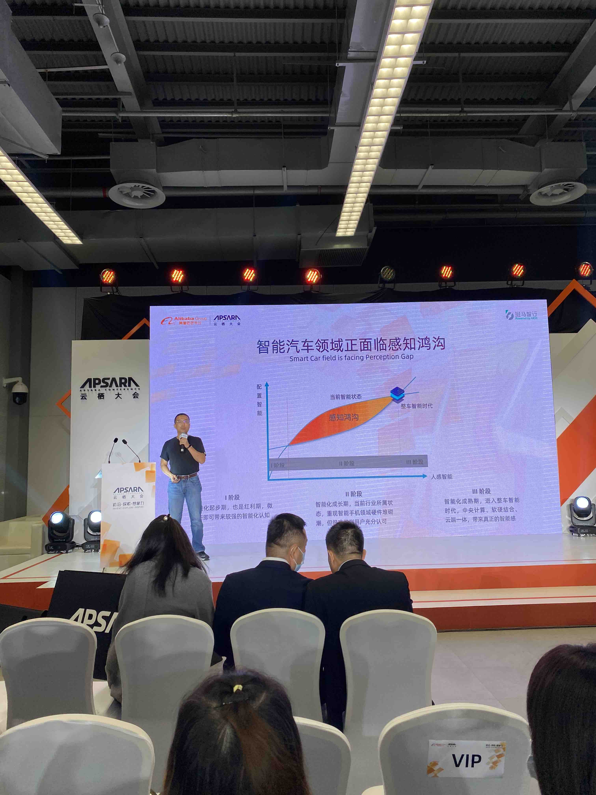
  
* 多脑并行，多域割裂
  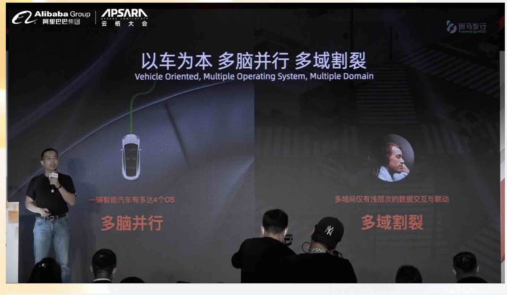
  
* 智能汽车面临的安全问题
  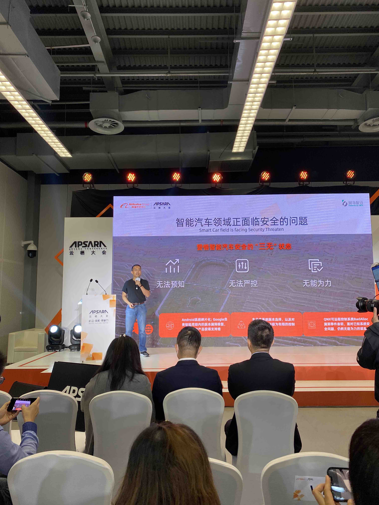

## 智能汽车演进路线
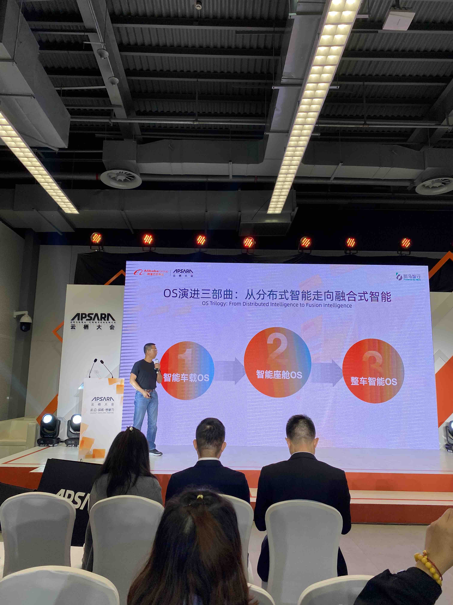

* 数据驱动汽车是真智能
  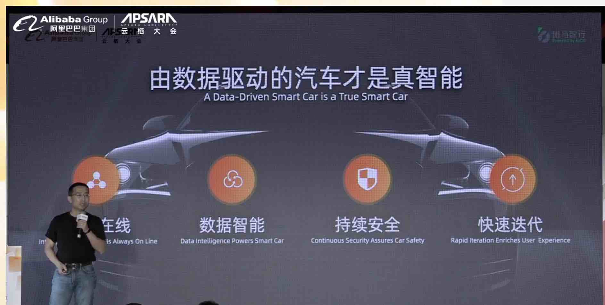
  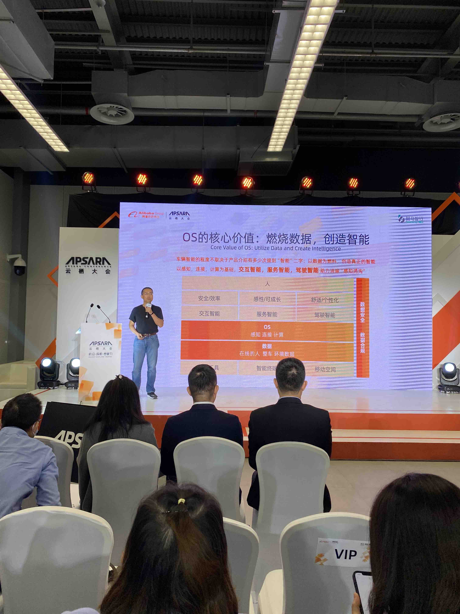
  
* 交互智能
  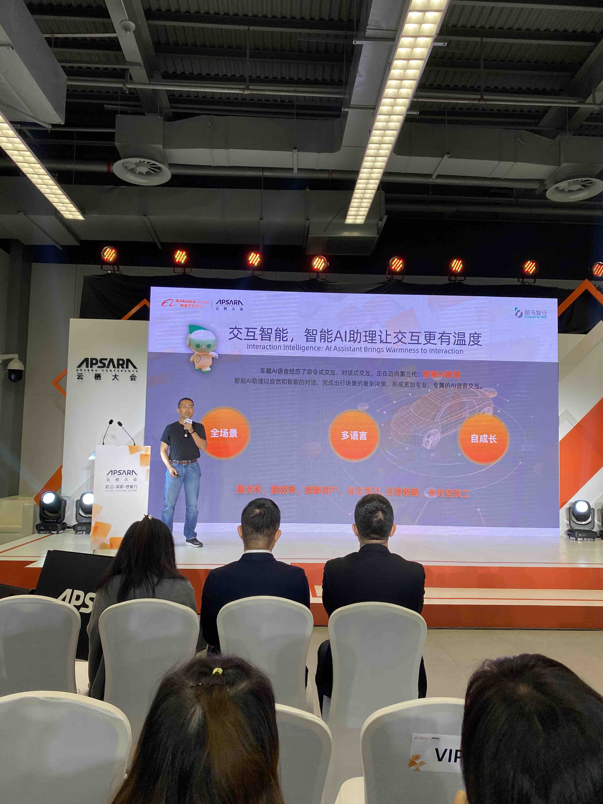

* 服务智能
  

* 驾驶智能
  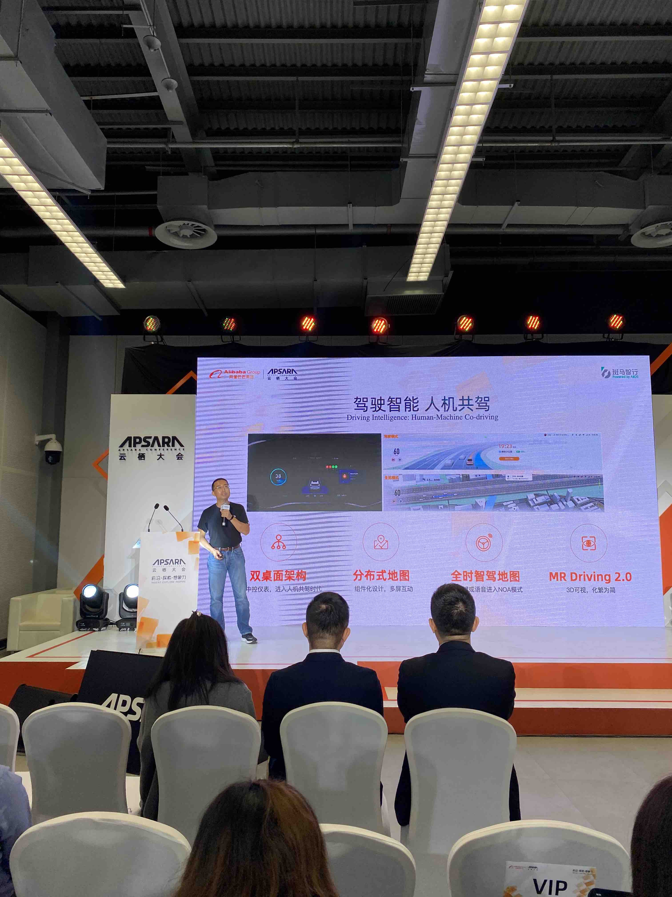
  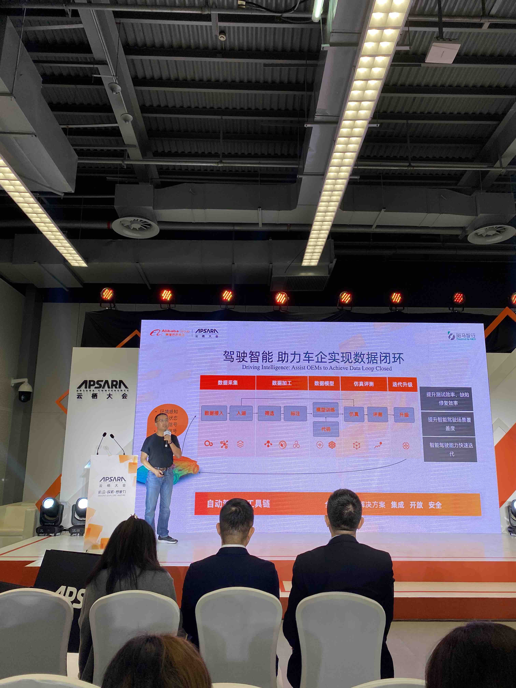
  
* 安全
  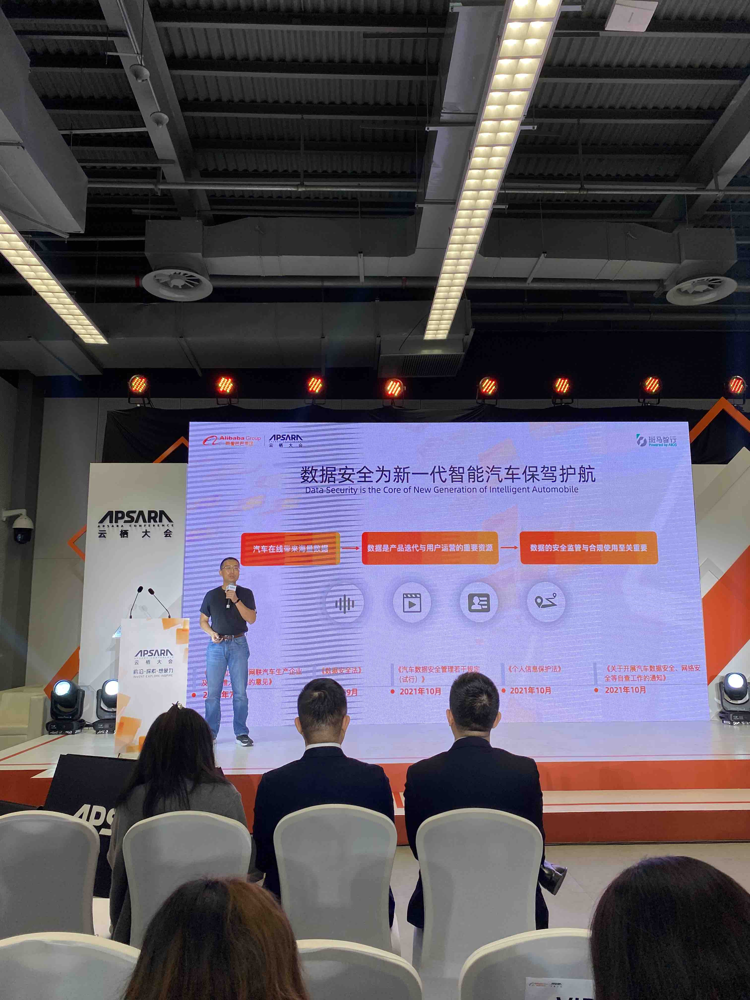
  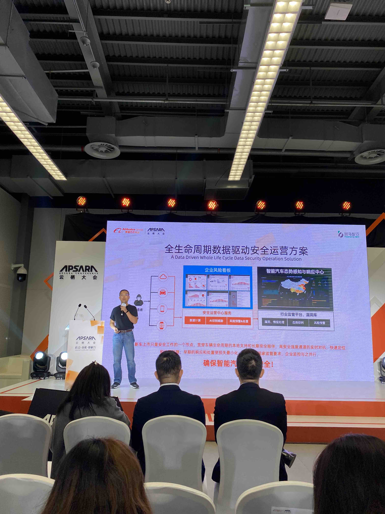
  
* 未来构想
  * 跨域融合
  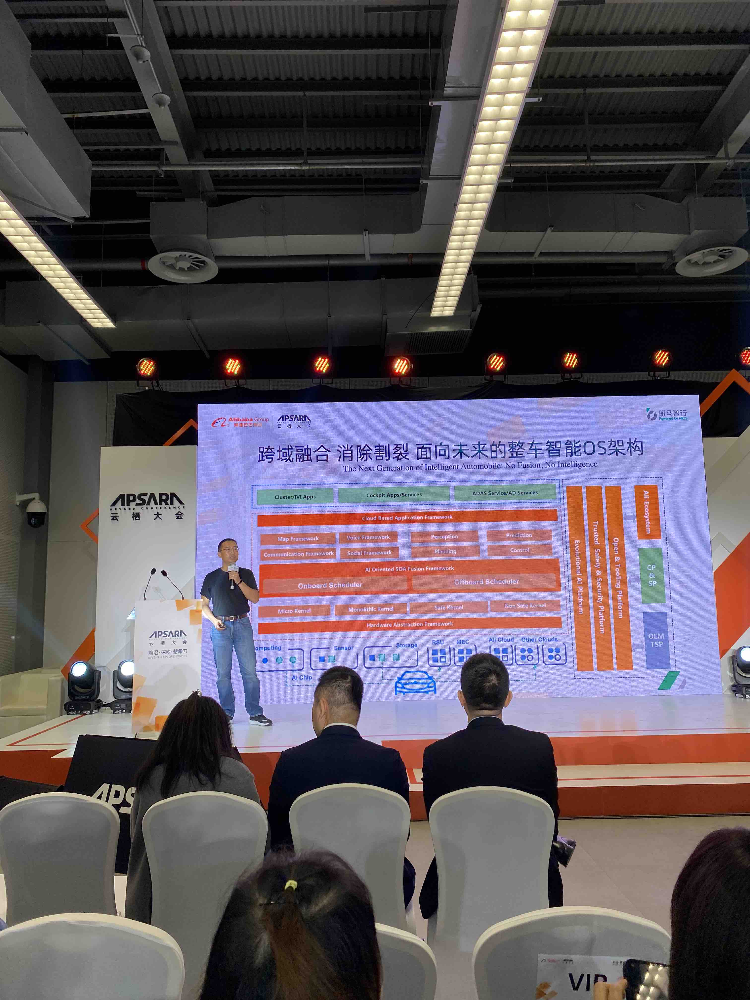

  * 多空间
  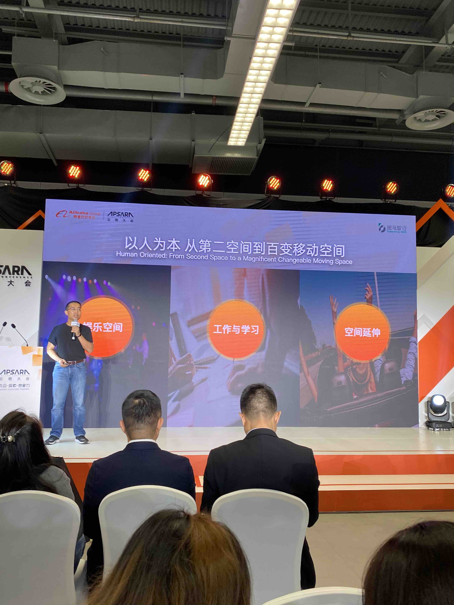
  
