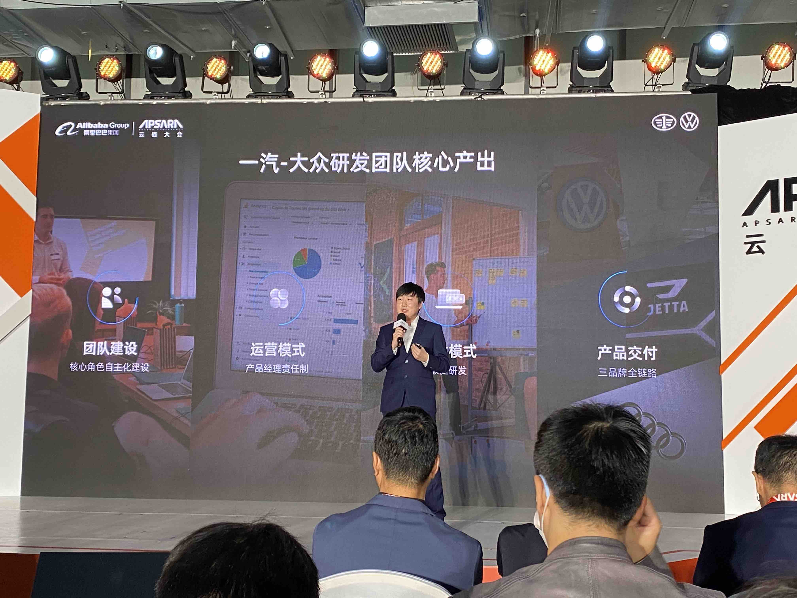
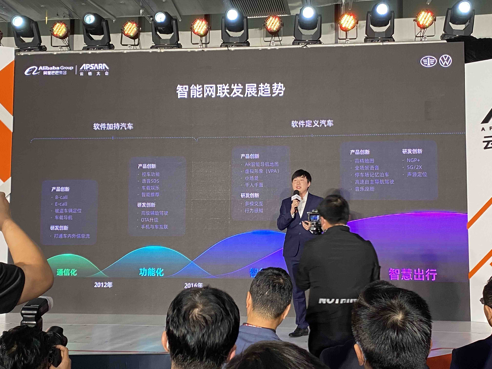
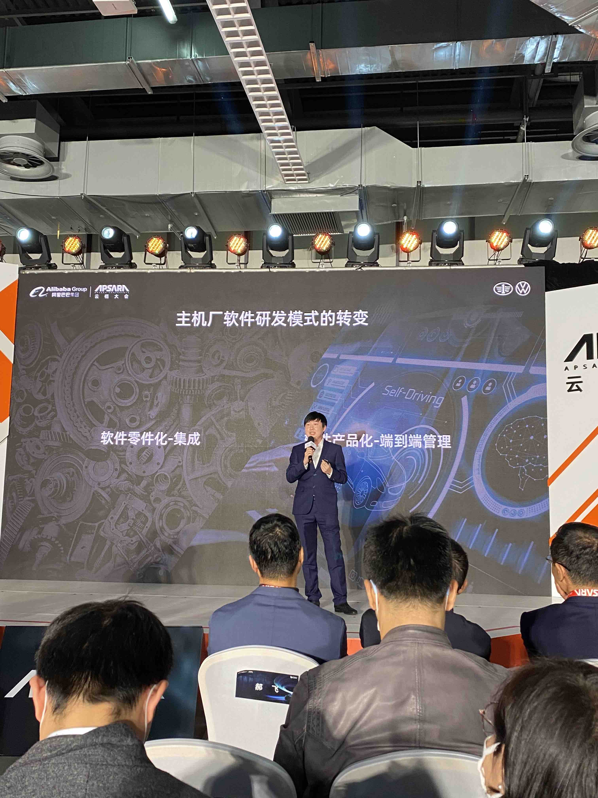
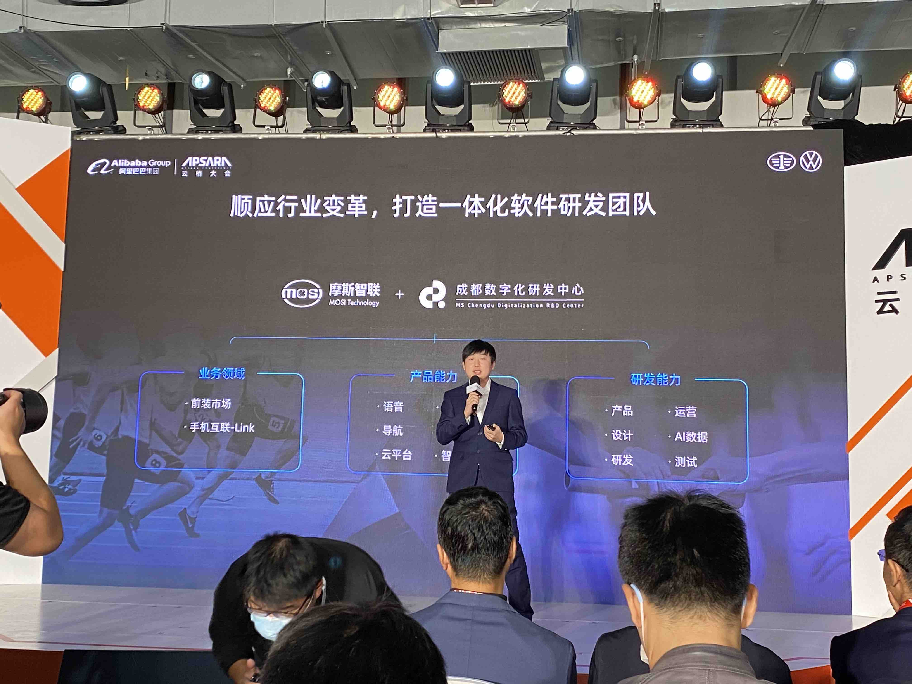

# 一汽捷达 – 产品数字化升级之路

## 研发团队的核心产出

* 团队建设
* 运营模式
* 研发迭代
* 产品交付

## 发展过程

* 1G: ECALL/BCALL 车载导航 被盗车辆定位
* 2G: 远程控车，SDS，智能推荐，车载娱乐
* 3G：AR导航，小场景，虚拟形象，千人千面
* 4G: 高精地图，全场景语音，停车场记忆泊车，高速自主驾驶，音乐座舱

## 主机厂研发模式转变

* 软件零件话-集成，管端不管云，管开发不管运营
* 软件产品化-端到端管理
  
  

## 打造一个研发团队

* 业务领域：前装市场，手机互联
* 产品能力：SDS，导航，推荐，云平台，娱乐，智能家居
* 研发能力：产品，设计，研发，AI大数据，测试，运营

## 打造一个研发团队遇到困难

* 行业，产品，用户洞察不足
* 研发模式调整 外包--自研
* 人员专业能力不足

## 借助斑马打造自身能力
* 项目手把手研发，实战实践60名员工，以战代练
* 大数据架构联合设计

## 得到的提升

* 车联网项目共创： 赋能产品，提升研发能力，深化敏捷思维，氛围，运维能力 ，优化云架构
* 管理模式：组织架构，企业文化，人才招募，绩效管理，业务流程，职级序列

## 宣传
* 捷达30年在中国卖了460万辆

