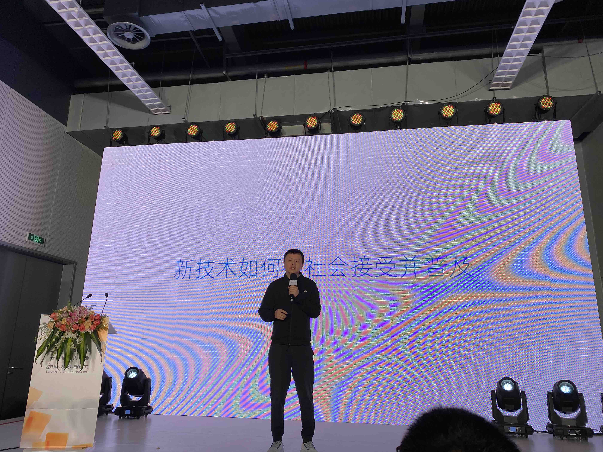
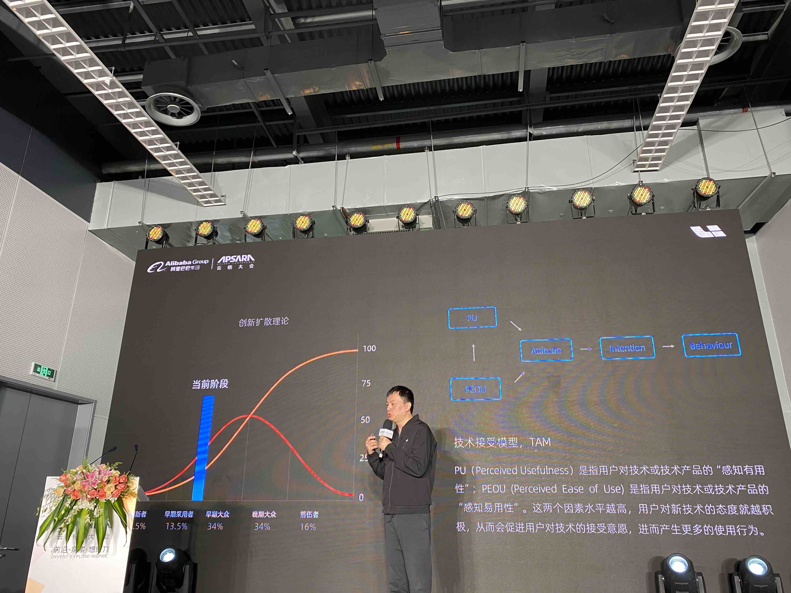
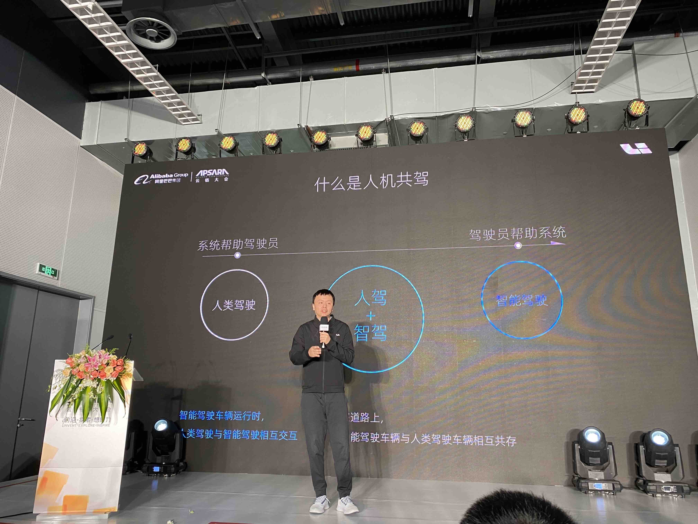
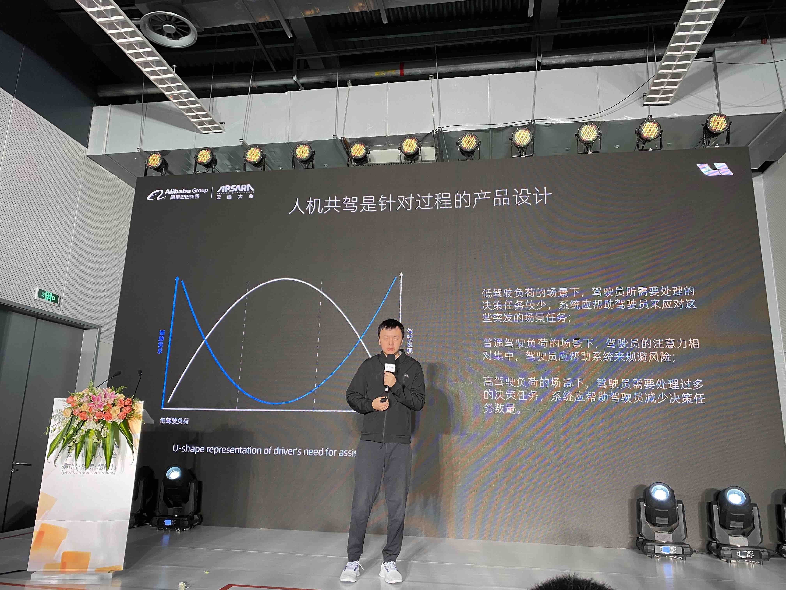
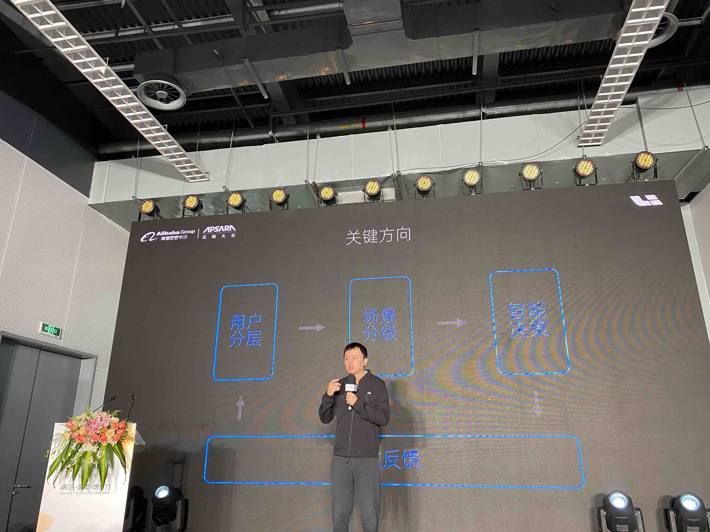
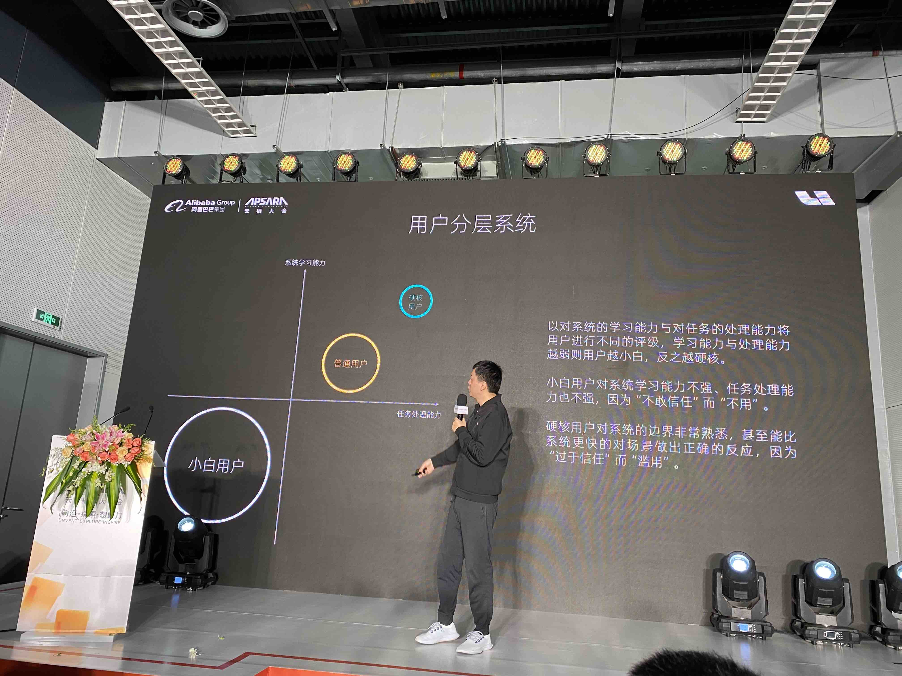
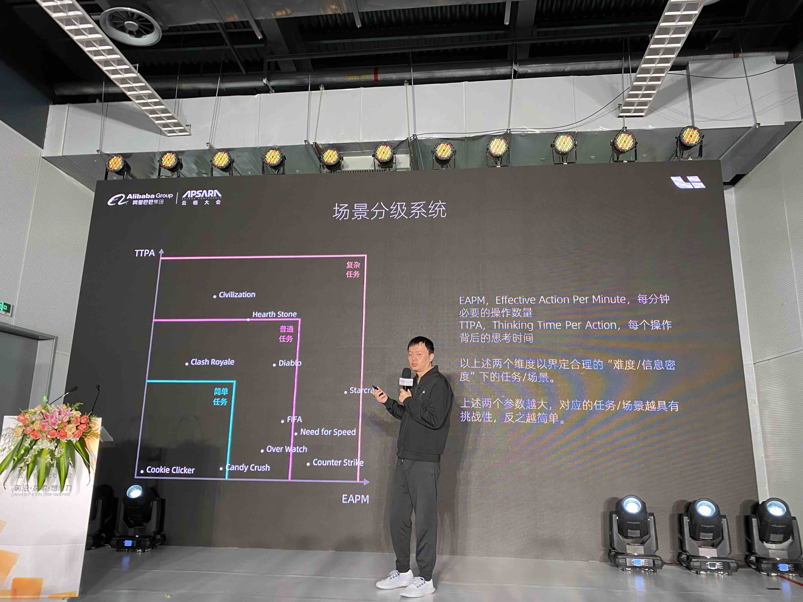
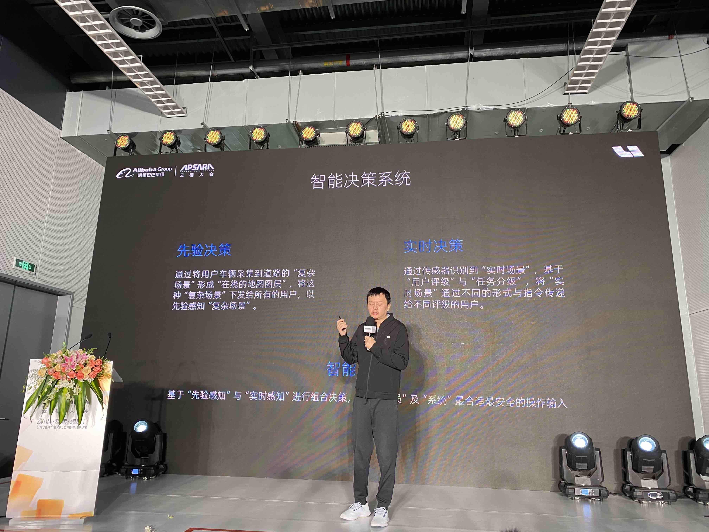
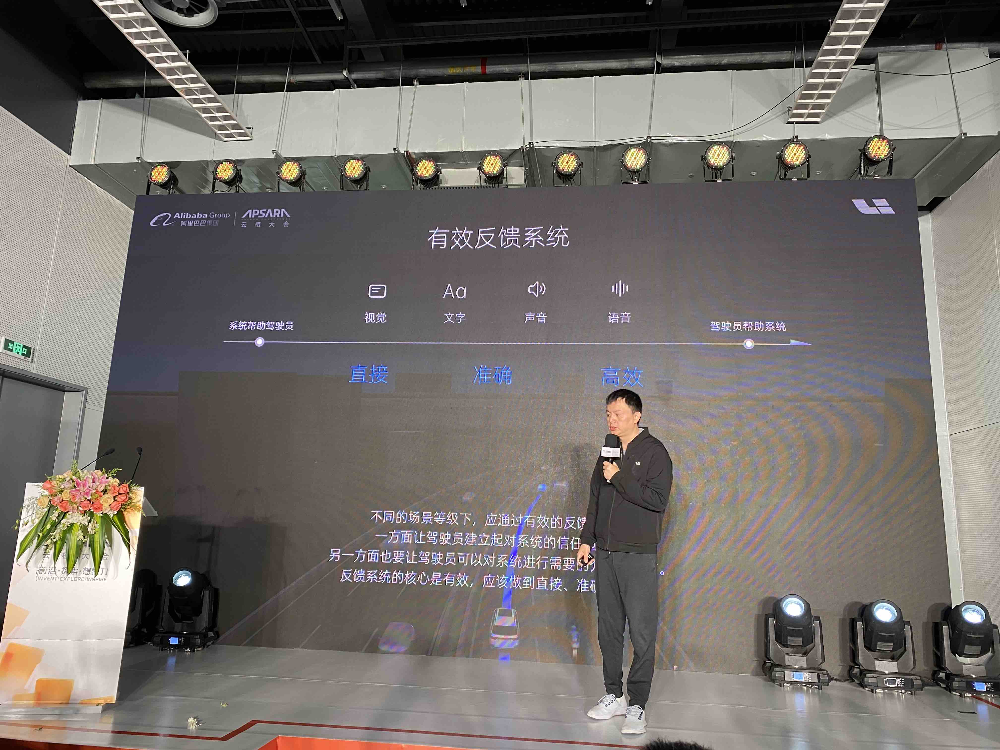

# 理想汽车 – 对于人机共驾的思考和实践

## 新技术如何被社会接受和普及

* PU：感知有用性，用户对产品的期待。
* PEOU：感知易用性，产品的实际使用体验。

## 什么是人机共驾

## 关键方向
* 用户分层
* 场景分级
* 智能决策
* 有效反馈

  
## 用户分层

## 场景分级

## 智能决策系统

## 有效反馈

## 人机共驾的理想状态

