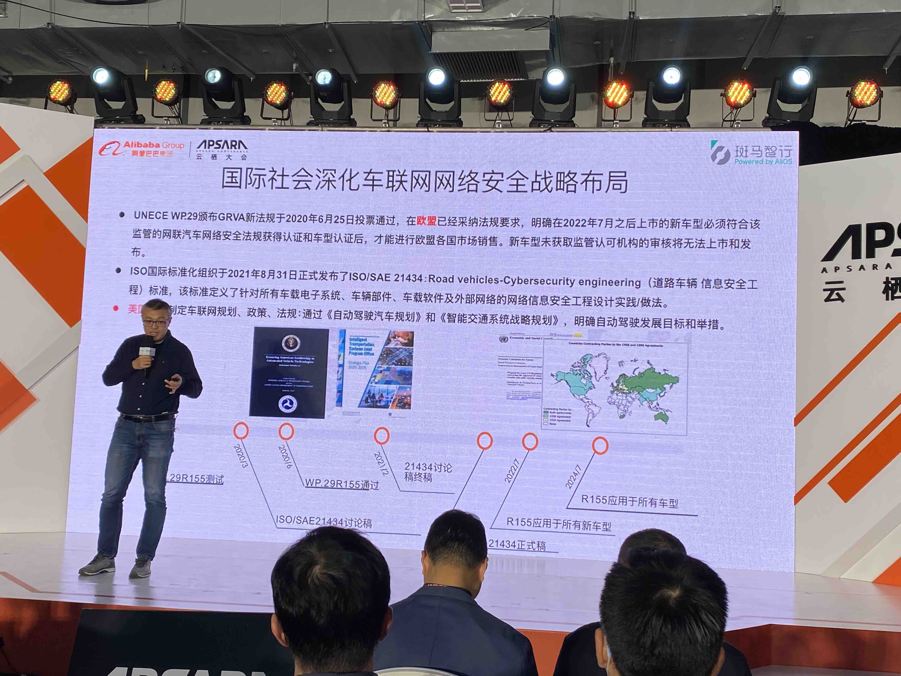

# 中科院信息所 – 车联网网络安全思考

## 智能网联车的安全现状

* 2020年网联车销量302万辆，增长107%
* 分为车控，汽车后市场，出行服务和生态服务。

## 车辆网生态复杂

## 车辆网架构演进

## 安全挑战

## 车辆网发展驱动安全需求

## 车联网安全法律管理体系

## 国际车辆网网联安全

* UNECE WP.29
* ISO/SAE 21434

## 我国现状

## 一些思考

* 云网端三位一体的安全防护

* 车联网汽车生命周期的研发管理
  
  
* 安全技术
  

