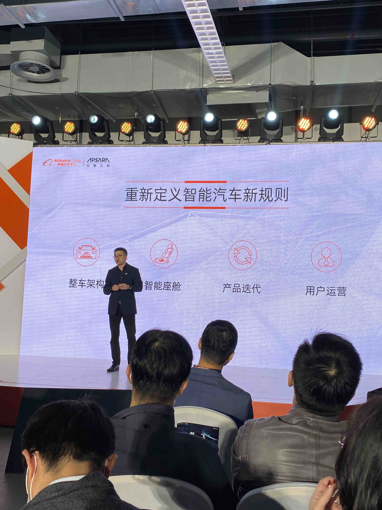
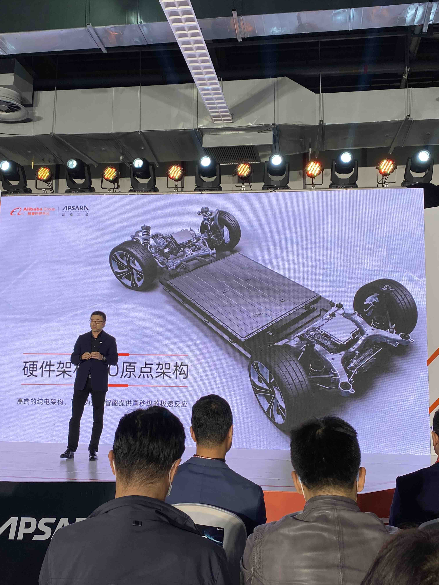
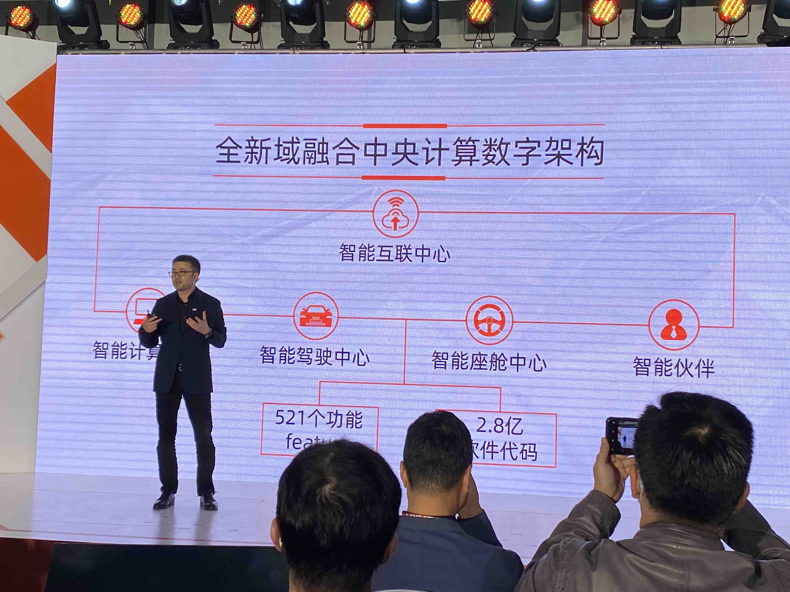
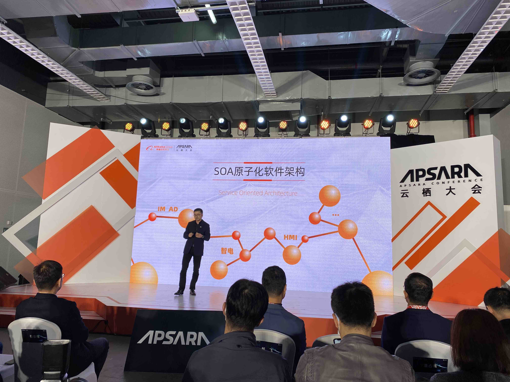
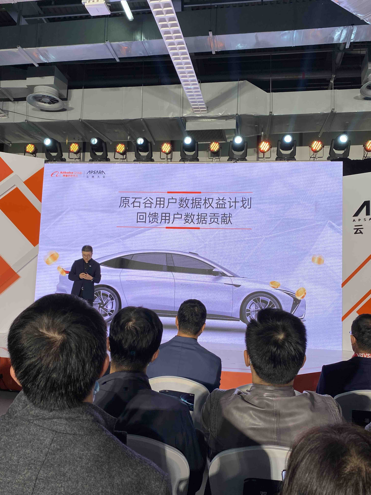

# 智己汽车 – 智能时代汽车该有的样子

## Overview
* 阿里巴巴 + 上汽集团 + 张江高科 共同投资

## 重新定义智能汽车新规则
* 整车架构
* 智能座舱
* 产品迭代
* 用户运营

`大众ID3 共使用53个月从设计到上市`

## IO原点架构-硬件电动化架构
* 硬件预留升级接口 - 激光雷达

## EE:全域融合的中央计算架构

## 软件：SOA原子化软件架构

## 用户运营

